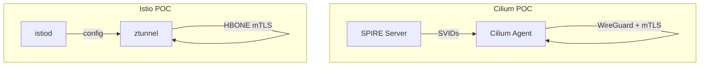

<!-- cSpell:ignore shellcheck,shcheck -->
# Agent Setup for mTLS Authentication POC

## Repository Goal

Compare mTLS authentication approaches for Kubernetes workloads:

1. **Cilium + SPIRE** - CNI-level mTLS with built-in SPIRE
1. **Istio Ambient** - ztunnel proxy with HBONE mTLS
1. **Ghostunnel** - Lightweight sidecar with SPIRE

Environment: Local Kind cluster with e2e tests.

## Scope

- Pod-to-pod encryption with mutual TLS
- Automatic authentication of every connection (no app changes)
- Cryptographic workload identity via SPIFFE
- Workload clusters only (single cluster, no federation)
- CNI-agnostic (must work with both Cilium and Calico)

## Project Standards

**CRITICAL**: ALL tasks must use Makefile targets. Never run scripts directly.

POC targets:

- `make cilium` - Run Cilium mTLS POC (full e2e)
- `make cilium-clean` - Clean up Cilium POC
- `make istio` - Run Istio Ambient mTLS POC (full e2e)
- `make istio-clean` - Clean up Istio POC
- `make ghostunnel` - Run Ghostunnel POC
- `make envoy` - Run Envoy POC

Core targets:

- `make lint` - Run all linters (shellcheck + markdownlint)
- `make clean` - Clean all POCs
- `make help` - Show all targets

## Rules

### Git Operations

Agents shall not perform any git operations like add, commit, revert,
but may perform operations like git checkout to revert individual files.
Committing changes is user-only operation, unless explicitly allowed by
the user in the current conversation.

### Output Formatting

#### Markdown

All markdown needs to be valid. Run `markdownlint-cli2` to lint all
"*.md" files in the current directory, recursively, and the output must
be clean. Markdown uses compact tables.

#### YAML

All YAML must use Kubernetes-style indentation: list items are not
indented relative to their parent key.

#### Emojis

No emojis may be used in scripts or markdown.

#### Mermaid

All ascii-art should be Mermaid-diagrams instead.

#### Unicode

No non-ASCII characters may be used in scripts or markdown.

### Research

All research must use web search for the latest information. Old
information from model training must not be used. All proof-of-concept
code must use latest stable versions, or when necessary, latest
unstable versions or HEAD of the respective git repositories.

All results must include as many in-line linked references to sources
as possible, for human verification. Official documentation and source
code is preferred over Reddit or Stack Overflow.

## Directory Structure

```text
cilium/        # Cilium + SPIRE POC
  manifests/   # Helm values, Kind config
  scripts/     # Deployment and test scripts
istio/         # Istio Ambient POC
  manifests/   # Helm values, Kind config
  scripts/     # Deployment and test scripts
envoy/         # Envoy per-node POC
ghostunnel/    # Ghostunnel sidecar POC
docs/          # Documentation
hack/          # Linting tools
```

## Documentation

### Implementation Docs

- `docs/FOUNDATION.md` - SPIRE + CNI setup, system exclusions
- `docs/MULTI-CLUSTER.md` - Metal3 isolated cluster model

### Research Docs

- `docs/RESEARCH.md` - Main research and comparison
- `docs/SPIFFE.md` - SPIFFE standard overview
- `docs/SPIRE.md` - SPIRE implementation overview
- `docs/CILIUM.md` - Cilium mTLS status
- `docs/CNI-ENCRYPTION.md` - Cilium/Calico WireGuard/IPsec
- `docs/PROXY-OPTIONS.md` - Proxy comparison for SPIRE

## Code Quality

- All shell scripts must pass: `make shellcheck`
- All markdown files must pass: `make markdownlint`
- Run `make lint` before committing

## Architecture



## Resources

- SPIFFE: <https://spiffe.io/>
- Cilium mTLS: <https://docs.cilium.io/en/latest/network/servicemesh/mutual-authentication/>
- Istio Ambient: <https://istio.io/latest/docs/ambient/>
