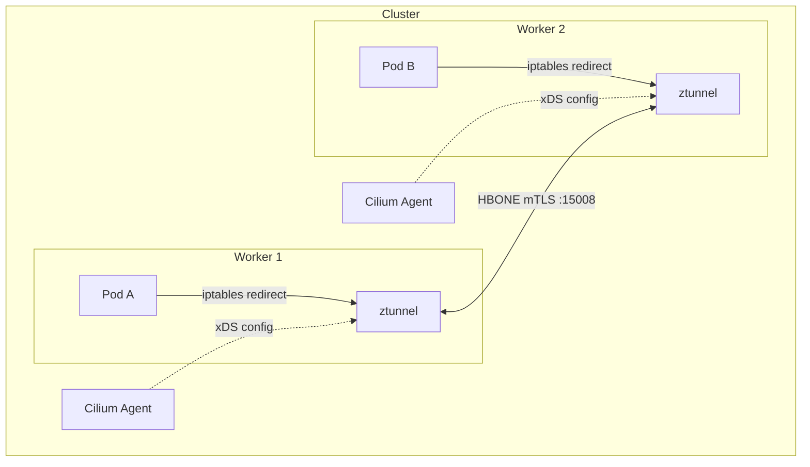
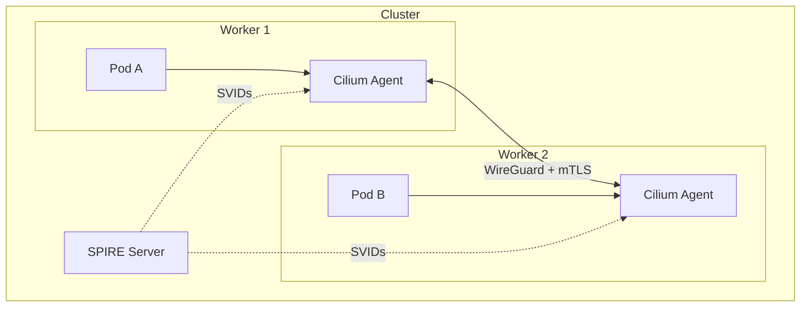
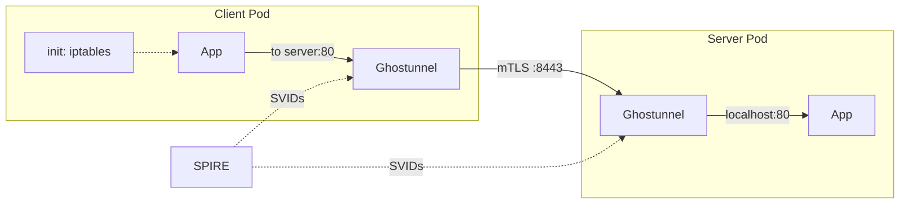
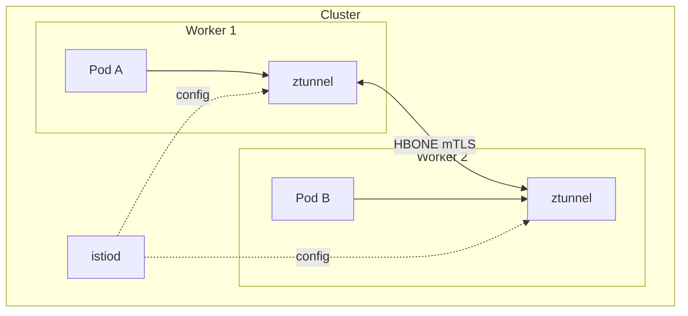

# mTLS Authentication POC

Proof-of-concept implementations for mutual TLS authentication in Kubernetes.

## Goal

Zero-trust pod-to-pod networking for CNF workloads on bare-metal Kubernetes.

## Scope

- Pod-to-pod encryption with mutual TLS
- Automatic authentication of every connection (no app changes)
- Cryptographic workload identity via SPIFFE
- Workload clusters only (single cluster, no federation)
- CNI-agnostic (must work with both Cilium and Calico)

Note: WireGuard/IPsec alone is not sufficient. CNI-level encryption
(Cilium, Calico) operates node-to-node -- it encrypts traffic between
nodes but does not authenticate individual workloads. A compromised
pod on the same node can still reach any other pod. Workload-level
mTLS with SPIFFE identity is required for true zero-trust.

## How mTLS Works

Transparent mTLS in Kubernetes has three independent layers. Each
POC in this repo makes different choices at each layer.

### 1. Identity: How Workloads Get Certificates

Something must issue a TLS certificate to each workload so it can
prove its identity to peers.

**Static CA (Cilium Ztunnel)**: A pre-generated CA keypair is stored
in a Kubernetes secret. The Cilium agent uses this CA to sign
ephemeral leaf certificates on demand. There is no workload
attestation -- any pod in an enrolled namespace gets a certificate.
The CA does not rotate automatically; the
[docs][ztunnel-docs] provide a script that generates 10-year
certificates. The secret uses custom key names
(`ca-private.key`, `bootstrap-root.crt`), so cert-manager cannot
manage it directly.

**SPIRE (Cilium + SPIRE, Ghostunnel)**: A SPIRE server issues
short-lived SVIDs ([SPIFFE][spiffe] Verified Identity Documents) via
per-node SPIRE agents. The agent attests each workload -- verifying
the pod is running on the claimed node, labels match, and the
service account is correct -- before requesting an identity from the
server. SVIDs rotate automatically (typically 1h TTL). The CA is
managed by SPIRE and rotates on its own schedule.

**istiod (Istio Ambient)**: istiod acts as the CA and issues
short-lived certificates to ztunnel proxies. Workload identity is
derived from the Kubernetes service account. Certificates rotate
automatically. istiod supports pluggable CA backends including
cert-manager via [istio-csr][istio-csr]. istiod is not SPIRE, but
the identities it issues are [SPIFFE][spiffe]-compliant.

[ztunnel-docs]: https://docs.cilium.io/en/stable/security/network/encryption-ztunnel/
[istio-csr]: https://cert-manager.io/docs/usage/istio-csr/
[spiffe]: https://spiffe.io/

### 2. Data Plane: Where TLS Terminates

Something must actually perform the TLS handshake and
encrypt/decrypt traffic.

**Per-node proxy (Cilium Ztunnel, Istio Ambient)**: A shared
[ztunnel][ztunnel-repo] DaemonSet runs on each node. All enrolled
pods on that node share the same proxy. This means one process per
node handles mTLS for all workloads -- efficient, but the proxy has
access to all workload keys on that node.

**Per-pod sidecar (Ghostunnel)**: Each pod gets its own Ghostunnel
sidecar container. The sidecar only has access to its own workload's
key. More isolation, but more resource overhead (one proxy process
per pod).

**Kernel eBPF (Cilium + SPIRE, deprecated)**: Cilium performs an
out-of-band mTLS handshake between agents, then uses eBPF in the
kernel data path. The TLS session keys are discarded after
authentication -- actual traffic encryption requires WireGuard
separately. This is why it was
[criticized][cilium-identity-risk] as "mTLess".

[ztunnel-repo]: https://github.com/istio/ztunnel
[cilium-identity-risk]: https://thenewstack.io/how-ciliums-mutual-authentication-can-compromise-security/

### 3. Interception: How Traffic Reaches the TLS Layer

Something must redirect application traffic through the proxy
without the application knowing.

**CNI-injected iptables (Cilium Ztunnel)**: The Cilium agent injects
iptables rules into each enrolled pod's network namespace. Traffic
is redirected to the local ztunnel proxy on ports 15001
(outbound) and 15006 (inbound).

**CNI plugin + GENEVE (Istio Ambient)**: The istio-cni DaemonSet
injects iptables rules and uses GENEVE tunnels to route traffic
through the node-level ztunnel proxy.

**Init container iptables (Ghostunnel)**: An init container with
`NET_ADMIN` capability injects iptables rules into the pod's network
namespace before the application starts. The rules redirect outbound
traffic to the local Ghostunnel sidecar.

**eBPF hooks (Cilium + SPIRE, deprecated)**: Cilium hooks into the
kernel networking stack via eBPF. No iptables or proxy in the data
path.

**Node-level iptables do not work**: Pods have isolated network
namespaces, so iptables rules on the host cannot intercept
pod-to-pod traffic. The [Envoy POC](envoy/) documents this
limitation.

### Plaintext Rejection

Encryption alone is not enforcement. If a non-mesh pod can still
reach a service over plaintext, mTLS is optional, not mandatory.

- **Istio Ambient**: PeerAuthentication `mode: STRICT` rejects
  connections that do not present a valid mTLS certificate.
  Non-mesh pods are blocked.
- **Ghostunnel**: The mTLS port (8443) rejects connections without
  a valid SPIRE-issued certificate. However, the application's
  plaintext port is still reachable unless network policy blocks it.
- **Cilium + SPIRE**: CiliumNetworkPolicy with
  `authentication.mode: required` blocks unauthenticated traffic.
- **Cilium Ztunnel**: No plaintext rejection. A non-enrolled pod
  can connect to an enrolled pod over plaintext. Ztunnel encrypts
  traffic between enrolled endpoints but does not block
  unauthenticated sources.

## Considered and Rejected

- **Linkerd**: Lightweight Rust sidecar with automatic mTLS.
  Rejected because stable release artifacts require a
  [commercial license][linkerd-license] ($2,000/cluster/month for
  organizations with 50+ employees). Edge releases remain open
  source but are not suitable for production.
- **Envoy per-node proxy**: SPIRE + Envoy DaemonSet with DIY
  iptables. Failed because node-level iptables cannot intercept
  pod-to-pod traffic (pods have isolated network namespaces).
  See [envoy/](envoy/) for details.

[linkerd-license]: https://buoyant.io/pricing

## Comparison

| | Cilium Ztunnel | Cilium + SPIRE | Ghostunnel + SPIRE | Istio Ambient |
| -- | ---------------- | ---------------- | --------------------- | --------------- |
| CNI | Cilium only | Cilium only | Any | Any |
| Transparent | Yes (iptables in pod netns) | Yes (eBPF) | Yes (init container) | Yes (istio-cni plugin) |
| Same-node mTLS | Yes | No | Yes | Yes |
| Identity | Static CA | SPIFFE/SPIRE | SPIFFE/SPIRE | SPIFFE/istiod |
| Workload attestation | No | Yes (SPIRE agent) | Yes (SPIRE agent) | Yes (istiod) |
| CA rotation | Manual (replace secret) | Automatic (SPIRE) | Automatic (SPIRE) | Automatic (istiod) |
| Leaf cert lifetime | Ephemeral (on demand) | Short-lived SVID | Short-lived SVID | Short-lived SVID |
| Components | Cilium agent, ztunnel DaemonSet | SPIRE server, SPIRE agent | SPIRE server, SPIRE agent, sidecar per pod | istiod, ztunnel, istio-cni |
| Ecosystem lock-in | Cilium CNI | Cilium CNI | None | Istio control plane |
| Plaintext rejection | No | Yes (CiliumNetworkPolicy) | Yes (mTLS port only) | Yes (PeerAuthentication STRICT) |
| Status | Beta (Cilium 1.19) | Deprecated | Stable | Stable |

Note: The old [Cilium + SPIRE](cilium/) mutual authentication is
[disabled by default in Cilium 1.19][cilium-ztunnel-rec] and has
[known security concerns][cilium-identity-risk]. Cilium Ztunnel is
the recommended replacement.

[cilium-ztunnel-rec]: https://github.com/cilium/cilium/releases/tag/v1.19.0

## Local Benchmarks

Measured on Kind cluster (2 workers, cross-node traffic):

| Solution | TCP Throughput | HTTP p99 @ 1000 RPS | Max QPS |
| ---------- | ---------------- | --------------------- | --------- |
| Cilium Ztunnel | 3.73 Gbps | 6.7 ms | 18k |
| Cilium + SPIRE (deprecated) | 1.53 Gbps | 1.9 ms | 97k |
| Istio Ambient | 938 Mbps | 5.97 ms | 55k |
| Ghostunnel (transparent) | 465 Mbps | 3.8 ms | 22k |

Notes:

- Cilium Ztunnel has highest throughput (hardware-accelerated
  AES-GCM) with same-node mTLS
- Cilium + SPIRE has lowest latency but no same-node mTLS and is
  deprecated in Cilium 1.19
- Istio Ambient balances throughput and features
- Ghostunnel transparent has lowest throughput (iptables + dual
  proxy hops) but no ecosystem lock-in

### External Benchmarks

Benchmarks from [Tel Aviv University (2024)][perf-arxiv] at 3200 RPS
with mTLS:

| Solution | P99 Latency | CPU Overhead | Memory Overhead |
| ---------- | ------------- | -------------- | ----------------- |
| Istio Ambient | +8% | Moderate | Lowest |
| Cilium + SPIRE | +99% | Lowest (measured) | Higher |
| Istio Sidecar | +166% | Highest | Highest |

Notes:

- Cilium kernel-level eBPF CPU usage is not captured by Prometheus
  ([source][perf-arxiv])
- Istio Ambient (ztunnel) provides highest encrypted throughput
  using hardware-accelerated AES-GCM
  ([source][perf-istio-throughput])
- At 1000-node scale, Istio delivered 56% more queries at 20% lower
  tail latency than Cilium ([source][perf-istio-scale])
- Cilium does not encrypt same-node traffic, which lowers its
  measured latency for intra-node workloads ([source][perf-arxiv])
- Ghostunnel adds ~2x latency per proxy hop
  ([source][perf-ghostunnel]); client + server sidecars means two
  hops

[perf-arxiv]: https://arxiv.org/html/2411.02267v1
[perf-istio-throughput]: https://istio.io/latest/blog/2025/ambient-performance/
[perf-istio-scale]: https://istio.io/latest/blog/2024/ambient-vs-cilium/
[perf-ghostunnel]: https://github.com/ghostunnel/ghostunnel/issues/256

## Architecture

### Cilium Ztunnel (Cilium clusters, recommended)



### Cilium + SPIRE (deprecated)



### Ghostunnel + SPIRE (Any CNI)



### Istio Ambient (Any CNI)



## Quick Start

```bash
# Cilium clusters
make cilium-ztunnel  # Cilium Ztunnel (recommended)
make cilium          # Cilium + SPIRE (deprecated)

# Any CNI (Calico, Cilium, etc.)
make ghostunnel  # Ghostunnel + SPIRE (lightweight)
make istio       # Istio Ambient (full featured)

# Failed experiment
make envoy       # Documents why DIY per-node proxy fails

# Clean up
make clean
```

## POC Summary

| POC | Status | CNI | Use Case |
| ----- | -------- | ----- | ---------- |
| `make cilium-ztunnel` | Working (beta) | Cilium | Transparent mTLS, highest throughput |
| `make cilium` | Working (deprecated) | Cilium | Old SPIRE-based mTLS |
| `make ghostunnel` | Working | Any | Lightweight, no lock-in |
| `make istio` | Working | Any | Full transparent mTLS |
| `make envoy` | Failed | Any | Documents per-node limitation |

## Make Targets

| Target | Description |
| -------- | ------------- |
| `make cilium-ztunnel` | Cilium Ztunnel POC (recommended for Cilium) |
| `make cilium` | Cilium + SPIRE POC (deprecated) |
| `make istio` | Istio Ambient POC |
| `make ghostunnel` | Ghostunnel sidecar POC |
| `make envoy` | Envoy per-node POC (failed) |
| `make clean` | Delete all clusters |
| `make lint` | Run linters |

## Directory Structure

```text
.
├── cilium/          # Cilium + SPIRE (deprecated)
├── cilium-ztunnel/  # Cilium Ztunnel (recommended for Cilium)
├── ghostunnel/      # Ghostunnel + SPIRE (any CNI)
├── istio/           # Istio Ambient (any CNI)
├── envoy/           # Envoy per-node (failed experiment)
├── docs/            # Research and reference docs
└── hack/            # Linting tools
```

## Requirements

- Docker
- Kind
- kubectl
- Helm 3

## Pinned Versions

| Component | Version |
| ----------- | --------- |
| Kubernetes (Kind) | v1.35.0 |
| Cilium | 1.19.0 |
| Istio | 1.28.3 |
| Gateway API CRDs | v1.4.0 |
| SPIRE Helm chart | 0.28.1 |
| SPIRE CRDs chart | 0.5.0 |
| Ghostunnel | v1.9.1 |
| Calico | v3.28.0 |
| Envoy | v1.32.2 |

## Documentation

### Implementation

| Document | Description |
| ---------- | ------------- |
| [FOUNDATION.md](docs/FOUNDATION.md) | SPIRE + CNI setup |
| [MULTI-CLUSTER.md](docs/MULTI-CLUSTER.md) | Metal3 isolated cluster model |

### Research

| Document | Description |
| ---------- | ------------- |
| [RESEARCH.md](docs/RESEARCH.md) | Main research and comparison |
| [SPIFFE.md](docs/SPIFFE.md) | SPIFFE standard overview |
| [SPIRE.md](docs/SPIRE.md) | SPIRE implementation overview |
| [CILIUM.md](docs/CILIUM.md) | Cilium mTLS status |
| [CNI-ENCRYPTION.md](docs/CNI-ENCRYPTION.md) | Cilium/Calico WireGuard/IPsec |
| [PROXY-OPTIONS.md](docs/PROXY-OPTIONS.md) | Proxy comparison for SPIRE |

<!-- cSpell:ignore spiffe,ztunnel,ghostunnel,svids,istiod,geneve,netns,svid -->
<!-- cSpell:ignore gbps,mbps -->
