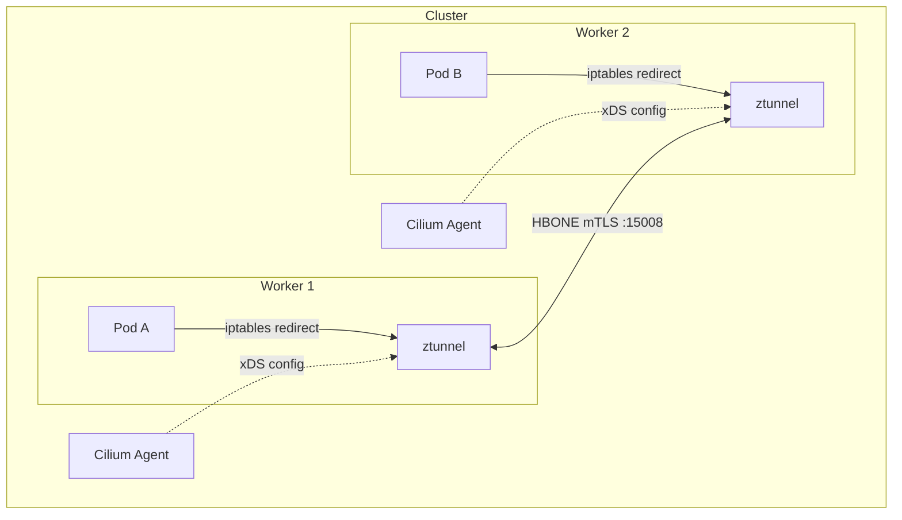

# Cilium Ztunnel mTLS POC

Transparent mTLS using Cilium's [ztunnel integration][ztunnel-docs]
(beta in Cilium 1.19). Ztunnel is a per-node proxy that provides L4
mTLS encryption via iptables redirection in each pod's network
namespace.

This replaces the [old Cilium + SPIRE approach](../cilium/) which is
disabled by default in Cilium 1.19.

[ztunnel-docs]: https://docs.cilium.io/en/stable/security/network/encryption-ztunnel/

## Architecture



- **Cilium Agent**: Manages ztunnel lifecycle and enrollment
- **ztunnel**: Per-node proxy handling mTLS (same binary as Istio)
- **Enrollment**: Per-namespace via `io.cilium/mtls-enabled=true` label
- **Secrets**: Pre-generated bootstrap + CA keypairs in
  `cilium-ztunnel-secrets`

## Quick Start

```bash
make run      # Full e2e: cluster, secrets, deploy, test
make clean    # Delete cluster
```

## What Gets Deployed

1. Kind cluster (1 control-plane + 2 workers)
1. Cilium 1.19.0 with `encryption.type=ztunnel`
1. Bootstrap + CA secrets for ztunnel authentication
1. Test namespace enrolled in ztunnel mTLS

## Make Targets

| Target | Description |
| ------ | ----------- |
| `make run` | Full e2e test |
| `make clean` | Delete cluster |
| `make validate` | Run validation checks |
| `make e2e-test` | Run e2e test only |
| `make enable-mtls` | Enroll test namespace |
| `make generate-secrets` | Generate ztunnel secrets |
| `make perf` | Run performance benchmarks |

## How It Works

1. Pre-generate bootstrap and CA TLS secrets
1. Deploy Cilium with `encryption.type=ztunnel`
1. Label namespace with `io.cilium/mtls-enabled=true`
1. Cilium injects iptables rules in each enrolled pod's netns
1. Traffic redirects to local ztunnel proxy
1. Ztunnel encrypts with mTLS over HBONE (port 15008)

## Limitations

- **Beta**: Not production-ready ([source][ztunnel-docs])
- **TCP only**: UDP and other protocols not redirected
- **No Cluster Mesh**: Incompatible with multi-cluster
- **Policy interference**: L4 network policies don't work for
  enrolled pods (traffic is encrypted before leaving the pod)
- **Both endpoints required**: Source and destination must both be
  enrolled for mTLS to work
- **No SPIRE**: Uses pre-generated CA, not SPIFFE/SPIRE identity
- **Manual secrets**: Bootstrap and CA keys must be generated before
  deployment

## Differences from Old Cilium + SPIRE

| | Old (Cilium + SPIRE) | New (Cilium + ztunnel) |
| -- | --------------------- | ------------------------ |
| Identity | SPIFFE/SPIRE | Pre-generated CA |
| Encryption | WireGuard (node-to-node) | HBONE mTLS (pod-to-pod) |
| Same-node mTLS | No | Yes |
| Interception | eBPF | iptables (pod netns) |
| Status | Disabled by default in 1.19 | Beta in 1.19 |
