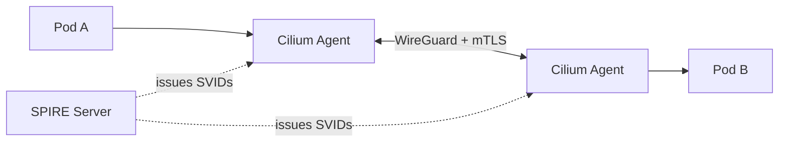

# Cilium + SPIRE mTLS POC

**Status: Deprecated approach.** Cilium 1.19 disables this out-of-band
mutual authentication by default and recommends ztunnel instead. See
[cilium-ztunnel/](../cilium-ztunnel/) for the current approach.

Mutual TLS authentication using Cilium's built-in SPIRE integration with
WireGuard node-to-node encryption.

## Known Issues

- **Disabled by default in Cilium 1.19**: The out-of-band mutual
  authentication feature is [disabled by default][cilium-ztunnel-rec],
  pending community feedback
- **Eventually consistent identity**: Cilium's identity model maps
  integers to IP addresses in node-local caches. Stale caches can
  cause identity confusion and policy violations
  ([source][cilium-identity-risk])
- **"mTLess" handshake**: Cilium performs a TLS handshake then
  discards session keys. Traffic after authentication is plaintext
  unless WireGuard is separately enabled
  ([source][cilium-identity-risk])
- **Roadmap incomplete**: Per-connection handshake, WireGuard
  integration, and penetration testing are all still TODO
  ([source][cilium-roadmap])

[cilium-ztunnel-rec]: https://github.com/cilium/cilium/releases/tag/v1.19.0
[cilium-identity-risk]: https://thenewstack.io/how-ciliums-mutual-authentication-can-compromise-security/
[cilium-roadmap]: https://docs.cilium.io/en/latest/network/servicemesh/mutual-authentication/mutual-authentication/

## Architecture



- **SPIRE Server**: Issues SPIFFE identities to Cilium agents
- **Cilium Agent**: Performs mTLS handshake for cross-node traffic
- **WireGuard**: Encrypts all node-to-node traffic
- **CiliumNetworkPolicy**: Enforces `authentication.mode: required`

## Quick Start

```bash
make run      # Full e2e: cluster, deploy, test, validate
make clean    # Delete cluster
```

## What Gets Deployed

1. Kind cluster (1 control-plane + 2 workers)
1. Cilium with WireGuard encryption
1. Cilium built-in SPIRE (server + agents)
1. Test namespace with mTLS policy

## Make Targets

| Target | Description |
| ------ | ----------- |
| `make run` | Full e2e test |
| `make clean` | Delete cluster |
| `make validate` | Run validation checks |
| `make e2e-test` | Run e2e test only |
| `make enable-mtls` | Enable mTLS on existing cluster |

## Implementation

### Prerequisites

- Phase 1 complete and validated (see [FOUNDATION.md](../docs/FOUNDATION.md))
- SPIRE server healthy with agents on all nodes
- Cilium with WireGuard operational

### Step 1: Create Default ClusterSPIFFEID

This assigns SPIFFE identities to application pods. System namespaces
are excluded to avoid bootstrap circular dependencies.

```bash
kubectl apply -f - <<YAML
apiVersion: spire.spiffe.io/v1alpha1
kind: ClusterSPIFFEID
metadata:
  name: default-workload-identity
spec:
  spiffeIDTemplate: >-
    spiffe://prod.metal3.local/ns/{{ .PodMeta.Namespace }}/sa/{{
    .PodSpec.ServiceAccountName }}
  podSelector: {}
  namespaceSelector:
    matchExpressions:
    - key: kubernetes.io/metadata.name
      operator: NotIn
      values:
      - kube-system
      - kube-node-lease
      - kube-public
      - spire-system
      - cert-manager
  ttl: 1h
YAML
```

### SPIRE Deployment Options

#### Option A: Cilium Built-in SPIRE (Recommended for POC)

Use `authentication.mutual.spire.install.enabled=true` - Cilium deploys and
manages SPIRE automatically. This handles the complex Delegated Identity API
socket configuration internally.

**Pros:**

- Simple setup, "just works"
- No manual socket mounting or `authorized_delegates` config
- Production-viable for single-cluster deployments

**Cons:**

- No multi-cluster federation support (Cluster Mesh + Mutual Auth incompatible)
- Single trust domain only

**Limitations (Cilium 1.18):**

- Mutual auth feature is still beta
- WireGuard integration marked TODO
- Per-connection handshake not yet implemented

#### Option B: External SPIRE

Manage SPIRE separately from Cilium. Required for Phase 3 multi-cluster
federation with shared trust domain.

**Challenge:** Cilium must use SPIRE's Delegated Identity API, which requires:

1. Cilium to first attest via workload socket (get its own identity)
1. Then call admin socket for delegated identity requests
1. SPIRE agent `authorized_delegates` must match Cilium's SPIFFE ID exactly

This is complex to configure correctly - if external SPIRE is needed, ensure
both sockets are mounted and `authorized_delegates` is properly set.

**Recommendation:** Start with Option A (built-in SPIRE) for POC. Revisit
external SPIRE when multi-cluster support matures in Cilium.

### Step 2: Create ClusterStaticEntry for Cilium Agent (External SPIRE Only)

Skip this step if using built-in SPIRE (Option A).

Cilium agents need admin-level SPIFFE identity to use SPIRE's Delegated
Identity API. This must be created BEFORE enabling Cilium mutual auth.

```bash
kubectl apply -f - <<YAML
apiVersion: spire.spiffe.io/v1alpha1
kind: ClusterStaticEntry
metadata:
  name: cilium-agent
spec:
  spiffeID: "spiffe://prod.metal3.local/cilium-agent"
  parentID: "spiffe://prod.metal3.local/spire/agent/k8s_psat/kind-mtls"
  selectors:
  - "k8s:ns:kube-system"
  - "k8s:sa:cilium"
  admin: true
YAML
```

Note: Adjust `parentID` cluster name (`kind-mtls`) to match your environment.
Find your cluster name with:

```bash
kubectl -n spire-system exec -it \
  $(kubectl -n spire-system get pod -l app.kubernetes.io/name=spire-server \
    -o jsonpath='{.items[0].metadata.name}') \
  -- /opt/spire/bin/spire-server entry show | grep "Parent ID"
```

### Step 3: Verify Identity Issuance

```bash
# Check SPIRE registration entries
kubectl -n spire-system exec -it \
  $(kubectl -n spire-system get pod -l app.kubernetes.io/name=spire-server \
    -o jsonpath='{.items[0].metadata.name}') \
  -- /opt/spire/bin/spire-server entry show

# Should see entries for running pods
```

### Step 4: Enable Cilium Mutual Authentication

#### Option A: Built-in SPIRE

```bash
helm upgrade cilium cilium/cilium \
  --namespace kube-system \
  --reuse-values \
  --set authentication.enabled=true \
  --set authentication.mutual.spire.enabled=true \
  --set authentication.mutual.spire.install.enabled=true
```

#### External SPIRE Configuration

```bash
helm upgrade cilium cilium/cilium \
  --namespace kube-system \
  --reuse-values \
  --set authentication.enabled=true \
  --set authentication.mutual.spire.enabled=true \
  --set authentication.mutual.spire.serverAddress=spire-server.spire-system.svc:8081
```

Verify:

```bash
cilium status | grep -i auth
```

### Step 5: Test Authentication (Non-Production Namespace)

Create test namespace with authentication required:

```bash
kubectl apply -f - <<YAML
apiVersion: v1
kind: Namespace
metadata:
  name: mtls-test
---
apiVersion: cilium.io/v2
kind: CiliumNetworkPolicy
metadata:
  name: require-auth
  namespace: mtls-test
spec:
  endpointSelector: {}
  ingress:
  - fromEndpoints:
    - {}
    authentication:
      mode: required
YAML
```

Deploy test workloads:

```bash
kubectl -n mtls-test run server --image=nginx --port=80
kubectl -n mtls-test expose pod server --port=80
kubectl -n mtls-test run client --image=curlimages/curl \
  --command -- sleep 3600
sleep 10  # Wait for pods and identities
kubectl -n mtls-test exec -it client -- curl http://server
```

Verify mTLS is active:

```bash
kubectl -n kube-system exec -it \
  $(kubectl -n kube-system get pod -l k8s-app=cilium \
    -o jsonpath='{.items[0].metadata.name}') \
  -- cilium bpf auth list
# Should show authenticated entries between client and server
```

### Step 6: Gradual Rollout to Production

Apply authentication per-namespace, starting with non-critical:

```bash
kubectl apply -f - <<YAML
apiVersion: cilium.io/v2
kind: CiliumNetworkPolicy
metadata:
  name: require-auth
  namespace: <target-namespace>
spec:
  endpointSelector: {}
  ingress:
  - fromEndpoints:
    - {}
    authentication:
      mode: required
YAML
```

### Step 7: Deploy trust-manager for Bundle Distribution

trust-manager distributes CA trust bundles across the cluster, ensuring
workloads can verify certificates from SPIRE. This is needed when
applications consume SPIFFE SVIDs directly.

```bash
helm repo add jetstack https://charts.jetstack.io
helm install trust-manager jetstack/trust-manager \
  --namespace cert-manager \
  --create-namespace \
  --set app.trust.namespace=cert-manager
```

## Key Configuration

`manifests/cilium-mtls-values.yaml`:

```yaml
authentication:
  enabled: true
  mutual:
    spire:
      enabled: true
      install:
        enabled: true
      trustDomain: prod.metal3.local
```

## Limitations

### Same-Node Traffic Skips Mutual Authentication

Cilium's mutual auth performs TLS handshakes **between Cilium agents on different
nodes**. For pods on the same node:

- No authentication handshake occurs
- No entries appear in `cilium bpf auth list`
- Traffic relies on local identity assignment by the agent

**Rationale:** The Cilium agent manages both endpoints locally and knows their
identities without network attestation. There's no agent-to-agent path to secure.

**Security implication:** Same-node identity is based on pod labels/selectors,
not cryptographic SPIFFE attestation. A compromised Cilium agent could
theoretically forge local identities.

**For strict zero-trust requirements:** Consider application-level mTLS (Envoy
sidecar, etc.) if cryptographic proof is required for all connections including
same-node.

### Same-Node Traffic Not Encrypted

WireGuard encryption is also skipped for same-node traffic. From Cilium docs:
"Encryption would provide no benefits in that case, given that the raw traffic
can be observed on the node anyway."

**Testing note:** Always test mutual auth with pods on **different nodes** to
verify the authentication handshake is working.

## E2E Test

The test proves mTLS enforcement:

1. **Positive**: Cross-node traffic between authenticated pods succeeds
1. **Negative**: Traffic from different namespace (same node) is blocked

## Validation Checklist

- [ ] ClusterStaticEntry for cilium-agent created with admin: true (external SPIRE)
- [ ] ClusterSPIFFEID created and reconciling
- [ ] SPIRE entries exist for running pods
- [ ] Cilium authentication enabled
- [ ] Test namespace workloads communicate with mTLS
- [ ] trust-manager deployed

## Rollback

Disable authentication:

```bash
helm upgrade cilium cilium/cilium \
  --namespace kube-system \
  --reuse-values \
  --set authentication.enabled=false
```

Remove policies:

```bash
kubectl delete ciliumnetworkpolicy require-auth -n <namespace>
```

Cleanup test:

```bash
kubectl delete namespace mtls-test
```
