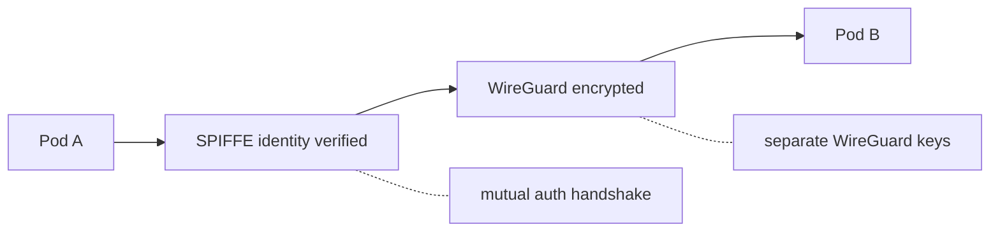
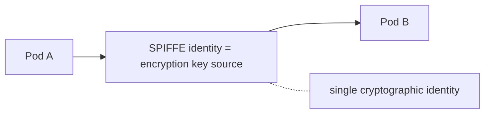

# Cilium Mutual Authentication Status

Reference for tracking Cilium mTLS maturity and planning decisions.

## Roadmap Status (Cilium 1.18)

Mutual authentication has been Beta since Cilium 1.14 (2023). As of 1.18,
the roadmap remains unchanged - no TODOs have been completed.

| Feature | Status |
| ------- | ------ |
| SPIFFE/SPIRE Integration | Beta |
| Authentication API for agent | Beta |
| mTLS handshake between agents | Beta |
| Auth cache (per-identity handshake) | Beta |
| CiliumNetworkPolicy support | Beta |
| Integrate with WireGuard | TODO |
| Per-connection handshake | TODO |
| Sync ipcache with auth data | TODO |
| Detailed security model docs | TODO |
| Penetration test | TODO |
| Minimize packet drops | TODO |
| Use auth secret for network encrypt | TODO |
| Review maturity for stable | TODO |

Source: [Cilium Mutual Auth Docs][cilium-mtls]

## Known Limitations

### Cluster Mesh + Mutual Auth Incompatible

> "There is no current option to build a single trust domain across
> multiple clusters. Clusters connected in a Cluster Mesh are not
> currently compatible with Mutual Authentication."

### Same-Node Traffic

- No mTLS handshake for pods on same node
- No WireGuard encryption for same-node traffic
- Identity based on local agent knowledge, not cryptographic attestation

### WireGuard Integration (TODO) - Clarification

**This does NOT mean you can't use both.** You can and should enable both
WireGuard and mutual auth together. They work simultaneously.

What "Integrate with WireGuard" TODO means:

| Aspect | Current State | Future Integration |
| ------ | ------------- | ------------------ |
| Authentication | SPIFFE via TLS handshake | Same |
| Encryption | WireGuard separate keys | WireGuard from SPIFFE |
| Key material | Two separate sources | Single source (SPIFFE) |
| Cryptographic binding | Independent | Unified |

**Current flow (works today):**

**Future integrated flow:**

**Practical impact:** None for functionality. You get authentication +
encryption today. The TODO is about tighter cryptographic binding, not
missing capability.

**Bottom line:** Enable both `encryption.type=wireguard` and
`authentication.mutual.spire.enabled=true`. Your traffic will be
authenticated AND encrypted.

## When External SPIRE is Required

| Scenario | Built-in | External |
| -------- | -------- | -------- |
| Isolated workload clusters | Yes | Not needed |
| Cross-cluster pod-to-pod mTLS | No | Needed, but Cilium unsupported |
| Unified trust domain across clusters | No | Needed |
| SPIRE upgrades independent of Cilium | No | Needed |
| Non-Cilium workloads need SPIFFE IDs | No | Needed |
| Federation with external orgs | No | Needed |

## Implications for Metal3 Deployment

For isolated workload clusters (no cross-cluster pod mTLS):

- Built-in SPIRE (`spire.install.enabled=true`) is sufficient
- External SPIRE adds complexity without benefit
- Revisit if Cilium adds Cluster Mesh + mutual auth support

## Tracking

- Cilium roadmap issue: [GitHub #28986][roadmap]
- CFP for improvements: [HackMD CFP][cfp]

[cilium-mtls]: https://docs.cilium.io/en/stable/network/servicemesh/mutual-authentication/
[roadmap]: https://github.com/cilium/cilium/issues/28986
[cfp]: https://hackmd.io/@youngnick/SJFj0UZha
