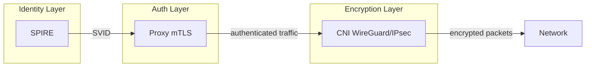

# CNI Encryption

Node-to-node encryption options for Cilium and Calico.

## Separation of Concerns



| Layer | Responsibility | Component |
| ----- | -------------- | --------- |
| Identity | Issue SPIFFE SVIDs | SPIRE |
| Authentication | Verify peer identity via mTLS | Proxy sidecar |
| Encryption | Encrypt all node-to-node traffic | CNI |

CNI encryption and proxy mTLS are independent. You can use either or both.

## Comparison

| Aspect | WireGuard | IPsec |
| ------ | --------- | ----- |
| Performance | Higher | Lower |
| Complexity | Simple | Complex |
| Code size | ~4000 lines | Large |
| FIPS compliant | No | Yes (with FIPS modules) |
| Protocol | UDP 51820 | ESP/AH |

## Cilium

### Cilium WireGuard (Recommended)

```yaml
# Helm values
encryption:
  enabled: true
  type: wireguard
  wireguard:
    userspaceFallback: false
```

Or via Helm install:

```bash
helm install cilium cilium/cilium \
  --namespace kube-system \
  --set encryption.enabled=true \
  --set encryption.type=wireguard
```

Verify:

```bash
cilium encryption status
```

Reference: [Cilium WireGuard documentation][cilium-wg]

### Cilium IPsec

```yaml
# Helm values
encryption:
  enabled: true
  type: ipsec
  ipsec:
    keyFile: /etc/ipsec.d/keys
```

Generate key:

```bash
kubectl create -n kube-system secret generic cilium-ipsec-keys \
  --from-literal=keys="3 rfc4106(gcm(aes)) $(openssl rand -hex 20) 128"
```

Reference: [Cilium IPsec documentation][cilium-ipsec]

## Calico

### Calico WireGuard

Available since Calico 3.13.

```bash
# Enable WireGuard for IPv4
calicoctl patch felixconfiguration default \
  --type='merge' \
  -p '{"spec":{"wireguardEnabled":true}}'
```

Or via kubectl:

```bash
kubectl patch felixconfiguration default \
  --type='merge' \
  -p '{"spec":{"wireguardEnabled":true}}'
```

Verify:

```bash
calicoctl node status
# Look for "WireGuard" in output
```

Reference: [Calico WireGuard documentation][calico-wg]

### Calico IPsec

```bash
kubectl patch felixconfiguration default \
  --type='merge' \
  -p '{"spec":{"ipsecMode":"Always"}}'
```

Reference: [Calico IPsec documentation][calico-ipsec]

## Same-Node Traffic

Both Cilium and Calico skip encryption for same-node pod traffic.

**Rationale:** Traffic between pods on the same node does not traverse the
network. Encryption provides no benefit since the raw traffic is observable
on the node anyway.

**Security implication:** If same-node encryption is required, use
application-level mTLS (proxy sidecar) instead of or in addition to
CNI encryption.

## FIPS Compliance

If FIPS 140-2/140-3 compliance is required:

- Use IPsec with FIPS-validated crypto modules
- WireGuard uses ChaCha20-Poly1305 which is not FIPS-approved

## Sources

- [Cilium WireGuard documentation][cilium-wg]
- [Cilium IPsec documentation][cilium-ipsec]
- [Calico WireGuard documentation][calico-wg]
- [Calico IPsec documentation][calico-ipsec]

[cilium-wg]: https://docs.cilium.io/en/latest/security/network/encryption-wireguard/
[cilium-ipsec]: https://docs.cilium.io/en/latest/security/network/encryption-ipsec/
[calico-wg]: https://docs.tigera.io/calico/latest/network-policy/encrypt-cluster-pod-traffic
[calico-ipsec]: https://docs.tigera.io/calico/latest/network-policy/encrypt-cluster-pod-traffic#enable-ipsec-encryption
