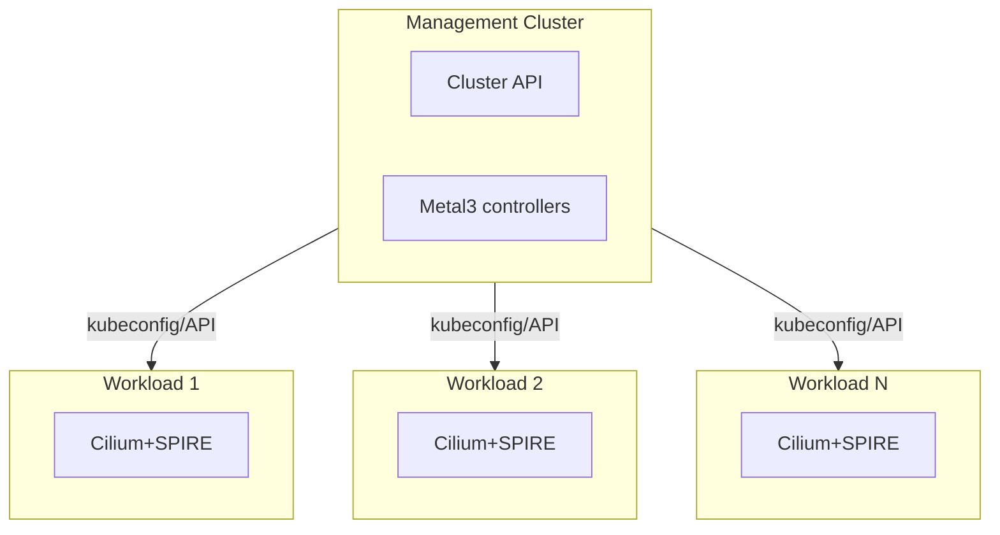

# Phase 3: Multi-Cluster (Metal3 Model)

Target architecture for Metal3 bare-metal: 1 management cluster + N workload
clusters, where workload clusters are isolated from each other.

## Architecture



Note: Workload clusters are isolated from each other. No cross-cluster pod mTLS.

## Key Design Decisions

### Each Workload Cluster is Self-Contained

- Independent Cilium installation with built-in SPIRE
- Own trust domain per cluster
- No cross-cluster pod-to-pod mTLS required
- Independent upgrade lifecycle

### Why This Works

| Concern | Resolution |
| ------- | ---------- |
| Cross-cluster mTLS | Not needed - clusters are isolated |
| Cluster Mesh + mutual auth | Limitation doesn't apply - no Cluster Mesh |
| SPIRE federation | Not needed - no shared trust domain |
| Built-in vs external SPIRE | Built-in is fine - self-contained clusters |

### Management Cluster Role

- Runs Cluster API + Metal3 controllers
- Communicates with workload clusters via API server (kubeconfig)
- Does NOT communicate pod-to-pod with workload clusters
- mTLS optional (no user workloads)

## Deployment Per Workload Cluster

Each workload cluster gets identical Cilium + SPIRE setup:

```bash
helm install cilium cilium/cilium \
  --namespace kube-system \
  --set cluster.name=workload-<N> \
  --set encryption.enabled=true \
  --set encryption.type=wireguard \
  --set authentication.enabled=true \
  --set authentication.mutual.spire.enabled=true \
  --set authentication.mutual.spire.install.enabled=true
```

### Trust Domain Naming

Use cluster-specific trust domains:

```yaml
# Per-cluster Helm values
authentication:
  mutual:
    spire:
      trustDomain: "workload-<N>.metal3.local"
```

Or use a naming convention:

- `workload-001.metal3.local`
- `workload-002.metal3.local`
- etc.

## Validation Per Cluster

Same as Phase 2 validation, repeated for each workload cluster:

```bash
# Verify SPIRE is running
kubectl -n cilium-spire get pods

# Verify mutual auth enabled
cilium status | grep -i auth

# Test with cross-node pods
kubectl -n mtls-test exec client -- curl http://server
kubectl -n kube-system exec ds/cilium -- cilium bpf auth list
```

## Operational Considerations

### Monitoring

- Each cluster has independent SPIRE metrics
- Consider centralized monitoring (Prometheus federation or remote-write)
- Alert on SPIRE server health per cluster

### Upgrades

- Clusters can be upgraded independently
- Cilium + built-in SPIRE upgrade together (single Helm release)
- No cross-cluster coordination required

### Scaling

- Adding new workload cluster = repeat Phase 1 + Phase 2
- No changes to existing clusters
- Linear scaling, no federation complexity

## What This Architecture Does NOT Support

If requirements change to need any of these, revisit with external SPIRE:

1. **Cross-cluster pod-to-pod mTLS** - would need Cluster Mesh + mutual auth
   (currently incompatible in Cilium)
1. **Unified identity across clusters** - would need SPIRE federation
1. **Centralized SPIRE management** - would need nested SPIRE topology

## Migration Path to External SPIRE (If Needed Later)

If future requirements need federation:

1. Deploy external SPIRE server (can start on mgmt cluster)
1. Configure SPIRE federation between trust domains
1. Migrate workload clusters one-by-one:
   - Disable built-in SPIRE
   - Point Cilium to external SPIRE
   - Verify identity issuance
1. Eventually consolidate to shared trust domain if needed

## Comparison: Built-in vs External SPIRE

| Aspect | Built-in (Current) | External (Future) |
| ------ | ------------------ | ----------------- |
| Complexity | Low | High |
| Multi-cluster federation | No | Yes |
| Independent upgrades | Tied to Cilium | Separate lifecycle |
| Operational overhead | Cilium manages | You manage |
| Suitable for isolated clusters | Yes Yes | Overkill |

For isolated workload clusters, built-in SPIRE is the right choice.
