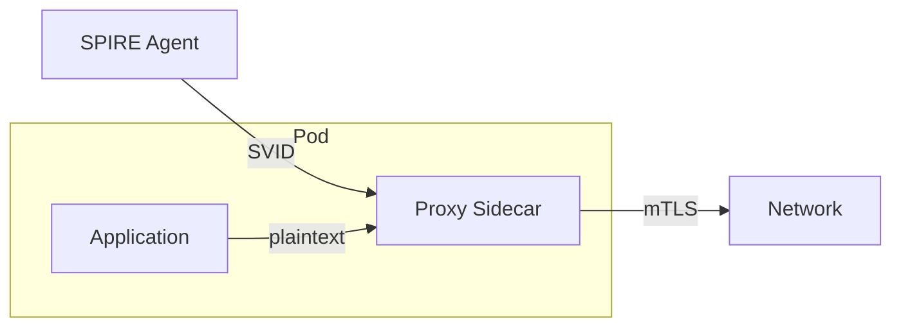
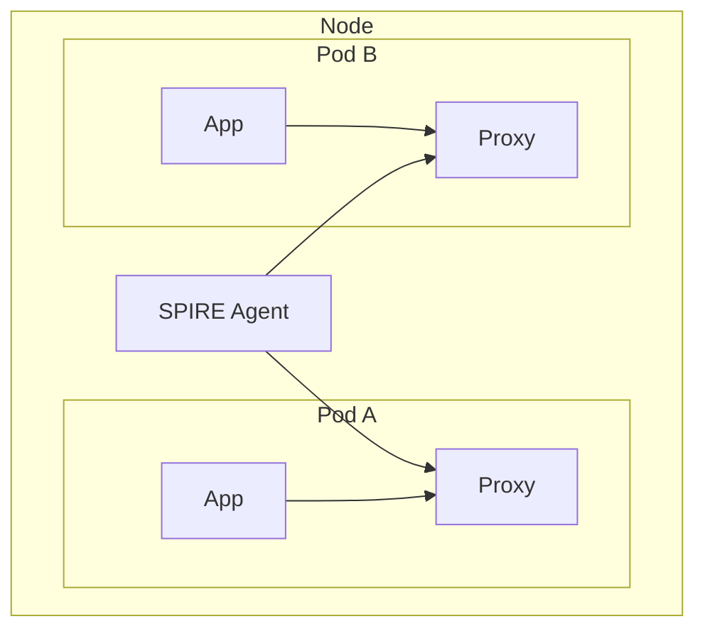
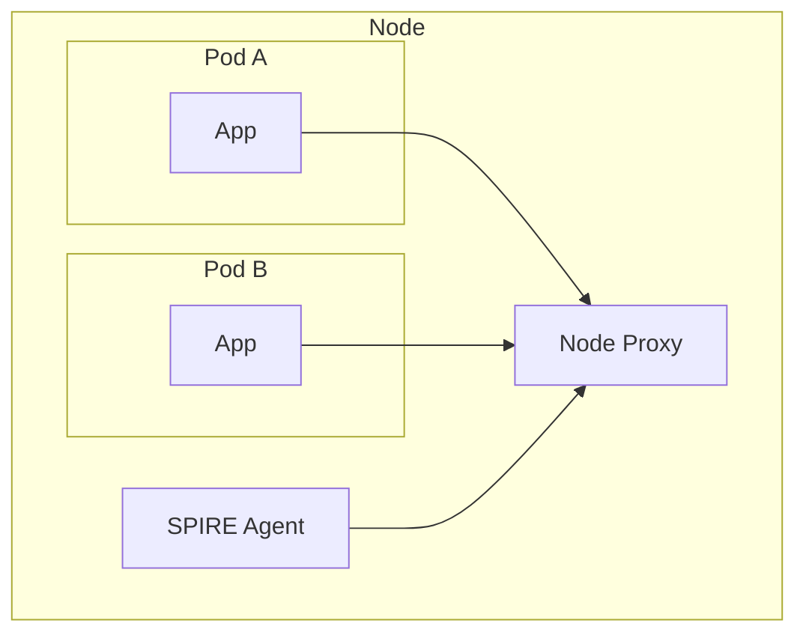

# Proxy Options for SPIRE mTLS

Proxy-based mTLS enforcement for workloads that cannot integrate directly
with the SPIFFE Workload API.

## Architecture



The proxy handles TLS termination and origination using SPIFFE SVIDs,
making mTLS transparent to the application.

## Proxy Comparison

| Proxy | SPIRE Integration | Server mTLS | Client mTLS | License | Notes |
| ----- | ----------------- | ----------- | ----------- | ------- | ----- |
| [Envoy][envoy] | SDS API | Yes | Yes | Apache-2.0 | Official integration |
| [Ghostunnel][ghostunnel] | Workload API | Yes | Yes | Apache-2.0 | Lightweight, purpose-built |
| [HAProxy][haproxy-spiffe] | SPIFFE/SPIRE | Yes | Yes | Commercial | Enterprise only |
| [Traefik][traefik-spiffe] | Workload API | **No** | Yes | MIT | Server-side pending |

### Recommendation

- **Envoy**: Best for full-featured proxy with L7 capabilities
- **Ghostunnel**: Best for lightweight mTLS tunneling without L7 features

## Integration Methods

### SDS (Secret Discovery Service)

Envoy's native method for dynamic certificate delivery.

```yaml
# Envoy cluster pointing to SPIRE agent
- name: spire_agent
  connect_timeout: 0.25s
  http2_protocol_options: {}
  load_assignment:
    cluster_name: spire_agent
    endpoints:
    - lb_endpoints:
      - endpoint:
          address:
            pipe:
              path: /run/spire/socket/agent.sock
```

The proxy requests certificates by SPIFFE ID:

```yaml
tls_certificate_sds_secret_configs:
- name: "spiffe://trust-domain/workload-id"
  sds_config:
    api_config_source:
      api_type: gRPC
      grpc_services:
        envoy_grpc:
          cluster_name: spire_agent
```

Reference: [Envoy SDS documentation][envoy-sds]

### SPIFFE Workload API

Direct integration with SPIRE agent socket. Used by Ghostunnel and Traefik.

```bash
ghostunnel server \
  --listen localhost:8443 \
  --target localhost:8080 \
  --spiffe-socket /run/spire/socket/agent.sock \
  --allow-uri-san "spiffe://trust-domain/allowed-client"
```

Reference: [Ghostunnel SPIFFE documentation][ghostunnel-spiffe]

### spiffe-helper (File-Based)

For proxies without native SPIFFE support. Writes certificates to disk
and signals the proxy to reload.

```hcl
# helper.conf
agent_address = "/run/spire/socket/agent.sock"
cert_dir = "/certs"
svid_file_name = "svid.pem"
svid_key_file_name = "svid_key.pem"
svid_bundle_file_name = "bundle.pem"
renew_signal = "SIGHUP"
```

Reference: [spiffe-helper repository][spiffe-helper]

## Deployment Models

### Sidecar (Per-Pod)

One proxy instance per application pod.



| Aspect | Impact |
| ------ | ------ |
| Isolation | Strong - each pod has own proxy |
| Resource use | High - proxy per pod |
| Latency | +166% P99 (sidecar Istio benchmark) |
| Failure domain | Pod-scoped |

### Per-Node

One proxy instance per node, shared by all pods.



| Aspect | Impact |
| ------ | ------ |
| Isolation | Weaker - shared proxy |
| Resource use | Low - one proxy per node |
| Latency | +8% P99 (Istio Ambient benchmark) |
| Failure domain | Node-scoped |

Reference: [Service mesh performance study][perf-study]

### Recommendation for CNF Workloads

Per-node deployment preferred for latency-sensitive CNF workloads.
Sidecar model adds significant latency overhead due to extra network hops.

## Traefik Limitation

Traefik 3.x supports SPIFFE for **outbound connections only** (client-side mTLS).
Server-side SPIFFE support (serving x509-SVID for incoming connections) is an
[open feature request since October 2022][traefik-issue] with no implementation.

**Workarounds:**

1. Use Traefik only for egress, pair with another proxy for ingress
1. Use TLS passthrough mode (no termination at Traefik)
1. Use Envoy or Ghostunnel instead

## Sources

- [Envoy SDS documentation][envoy-sds]
- [Ghostunnel SPIFFE support][ghostunnel-spiffe]
- [Traefik SPIFFE documentation][traefik-spiffe]
- [spiffe-helper repository][spiffe-helper]
- [HAProxy SPIFFE blog][haproxy-spiffe]
- [Service mesh performance study][perf-study]

[envoy]: https://www.envoyproxy.io/
[envoy-sds]: https://www.envoyproxy.io/docs/envoy/latest/configuration/security/secret
[ghostunnel]: https://github.com/ghostunnel/ghostunnel
[ghostunnel-spiffe]: https://github.com/ghostunnel/ghostunnel/blob/master/docs/SPIFFE-WORKLOAD-API.md
[haproxy-spiffe]: https://www.haproxy.com/blog/zero-trust-mtls-automation-with-haproxy-and-spiffe-spire
[traefik-spiffe]: https://doc.traefik.io/traefik/v3.3/reference/install-configuration/tls/spiffe/
[traefik-issue]: https://github.com/traefik/traefik/issues/9452
[spiffe-helper]: https://github.com/spiffe/spiffe-helper
[perf-study]: https://arxiv.org/html/2411.02267v1
