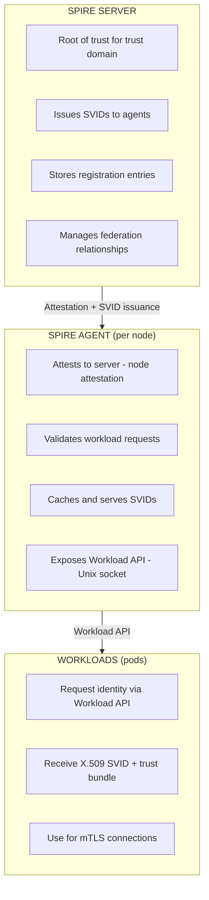
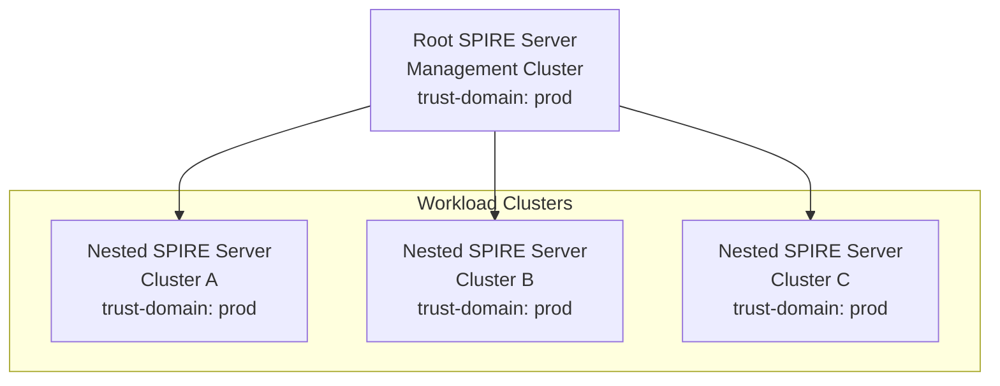
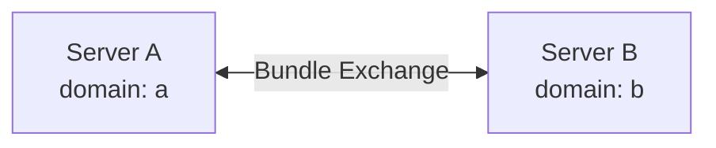
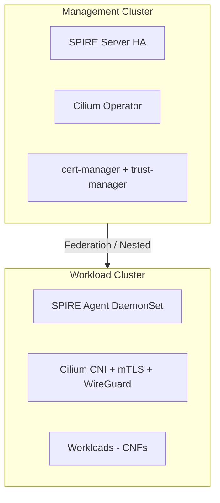

# Kubernetes Workload Identity & Authentication Research

## Comprehensive Study for Scalable mTLS Implementation

Context: Metal3 bare-metal Kubernetes (1-1000 nodes/cluster, potentially
1000s of clusters), CNF workloads, Cilium migration planned, cert-manager
in use.

---

## Table of Contents

- [Executive Summary](#executive-summary)
- [The Landscape](#the-landscape)
- [SPIFFE/SPIRE Deep Dive](#spiffespire-deep-dive)
- [Encryption Layer](#encryption-layer)
- [Architecture Patterns](#architecture-patterns)
- [Performance Considerations](#performance-considerations)
- [Compliance Mapping](#compliance-mapping)
- [Recommendations](#recommendations)

---

## Executive Summary

The 2025 consensus is clear: short-lived, verifiable workload identities
with mutual TLS is the path forward for zero-trust Kubernetes security.
SPIFFE/SPIRE has matured into production-grade infrastructure.

Key findings:

- SPIFFE is the standard, SPIRE is the reference implementation
- Cilium provides native SPIFFE integration with sidecarless mTLS (beta)
- cert-manager has csi-driver-spiffe for SPIFFE SVID delivery
- For telco CNF workloads, sidecarless architectures show 4-10x better
  latency than sidecar models
- Cross-cluster auth requires SPIRE federation or nested SPIRE topologies

---

## The Landscape

### What is Workload Identity?

Workload identity provides dynamic, verifiable identities for workloads
(pods, VMs, serverless), enabling:

- Secure service-to-service communication
- Zero-trust policy enforcement
- Elimination of static credentials/secrets

### The Problem with Traditional Approaches

| Approach | Issues |
| ---------------------- | ------------------------------------------- |
| Static secrets | Long-lived, can be compromised, hard rotate |
| Network-based (IP) | IPs change, not identity-aware |
| Service account tokens | Cluster-scoped, not portable |
| Manual cert management | Operational burden, rotation challenges |

### Modern Solution: SPIFFE

SPIFFE (Secure Production Identity Framework for Everyone) provides:

- Standardized identity format: `spiffe://trust-domain/path/encoded/info`
- Short-lived certificates: Auto-rotating X.509 SVIDs
- Attestation-based: Cryptographically verifiable identity
- Platform-agnostic: Works across K8s, VMs, multi-cloud

---

## SPIFFE/SPIRE Deep Dive

### Core Concepts

#### SPIFFE ID Format

```text
spiffe://trust-domain/workload-identifier

Examples:
spiffe://production.example.com/ns/default/sa/frontend
spiffe://cluster-a.metal3.local/ns/telco/pod/cnf-upf-xyz
```

#### SVID (SPIFFE Verifiable Identity Document)

- X.509 certificate containing SPIFFE ID in SAN field
- Short-lived (typically 1 hour, configurable)
- Auto-rotated by SPIRE agent

### SPIRE Architecture



### Attestation Mechanisms

#### Node Attestation (Agent to Server)

Proves the SPIRE agent is running on a legitimate node:

| Attestor | Use Case |
| --------- | ------------------------------------------- |
| k8s_psat | Kubernetes Projected Service Account Token |
| k8s_sat | Kubernetes Service Account Token (legacy) |
| aws_iid | AWS Instance Identity Document |
| gcp_iit | GCP Instance Identity Token |
| azure_msi | Azure Managed Service Identity |
| tpm_devid | TPM-based hardware attestation |
| x509pop | X.509 certificate proof of possession |

For Metal3/bare-metal: Use k8s_psat (recommended) or tpm_devid for
hardware-backed attestation.

#### Workload Attestation (Workload to Agent)

Proves the workload is what it claims to be:

| Attestor | Selectors Available |
| -------- | ------------------------------------------------ |
| k8s | ns, sa, pod-label, pod-name, container, node |
| unix | uid, gid, path |
| docker | label, image_id |

Kubernetes workload attestor retrieves pod info from kubelet:

```yaml
selectors:
- k8s:ns:telco-core
- k8s:sa:upf-service
- k8s:pod-label:app:upf
```

### SPIRE Controller Manager (Kubernetes-Native)

The spire-controller-manager provides CRD-based workload registration.

#### ClusterSPIFFEID CRD

```yaml
apiVersion: spire.spiffe.io/v1alpha1
kind: ClusterSPIFFEID
metadata:
  name: cnf-workloads
spec:
  spiffeIDTemplate: >-
    spiffe://{{ .TrustDomain }}/ns/{{ .PodMeta.Namespace }}/sa/{{
    .PodSpec.ServiceAccountName }}
  podSelector:
    matchLabels:
      spiffe-enabled: "true"
  namespaceSelector:
    matchLabels:
      environment: production
  ttl: 1h
  federatesWith:
  - "spiffe://partner-domain.example.com"
```

#### ClusterFederatedTrustDomain CRD

```yaml
apiVersion: spire.spiffe.io/v1alpha1
kind: ClusterFederatedTrustDomain
metadata:
  name: partner-federation
spec:
  trustDomain: partner-domain.example.com
  bundleEndpointURL: https://spire.partner.example.com:8443
  bundleEndpointProfile:
    type: https_spiffe
    endpointSPIFFEID: >-
      spiffe://partner-domain.example.com/spire/server
```

#### ClusterStaticEntry CRD

For non-K8s workloads or nested SPIRE servers:

```yaml
apiVersion: spire.spiffe.io/v1alpha1
kind: ClusterStaticEntry
metadata:
  name: downstream-spire-server
spec:
  spiffeID: >-
    spiffe://production.example.com/spire/downstream/cluster-b
  parentID: >-
    spiffe://production.example.com/spire/agent/k8s_psat/cluster-a/node
  selectors:
  - "k8s:ns:spire-system"
  - "k8s:sa:spire-server"
  downstream: true
```

### Multi-Cluster Deployment Models

#### Option 1: Nested SPIRE (Same Trust Domain)



Pros:

- Single trust domain = workloads trust each other automatically
- Hierarchical CA chain
- Good for clusters under same administrative control

Cons:

- Root server is single point of failure
- All clusters share same trust boundary

Best for: Metal3 management cluster + workload clusters under same org.

#### Option 2: Federated SPIRE (Different Trust Domains)



Pros:

- Independent trust domains
- Explicit federation relationships
- Better for multi-org or security boundaries

Cons:

- Requires explicit federation configuration
- Trust bundle distribution complexity

Best for: Cross-organization, multi-tenant, or security-isolated clusters.

### SPIRE High Availability

For production at scale:

```yaml
apiVersion: apps/v1
kind: StatefulSet
metadata:
  name: spire-server
spec:
  replicas: 3
  serviceName: spire-server
  selector:
    matchLabels:
      app: spire-server
  template:
    spec:
      containers:
      - name: spire-server
        image: ghcr.io/spiffe/spire-server:1.14.1
        args:
        - -config
        - /run/spire/config/server.conf
        volumeMounts:
        - name: spire-data
          mountPath: /run/spire/data
  volumeClaimTemplates:
  - metadata:
      name: spire-data
    spec:
      accessModes: ["ReadWriteOnce"]
      resources:
        requests:
          storage: 1Gi
```

Database backends for HA:

- PostgreSQL (recommended for production)
- MySQL
- SQLite (single-node only)

---

## Encryption Layer

### Two Layers of Encryption

| Layer | What it Protects | Technologies |
| ------------- | ----------------------------- | ------------------------- |
| Pod-to-Pod | App traffic between services | SPIFFE/SPIRE + Cilium |
| Node-to-Node | All traffic between nodes | Cilium WireGuard/IPsec |

### Cilium Encryption Options

#### WireGuard (Recommended)

```yaml
encryption:
  enabled: true
  type: wireguard
  wireguard:
    userspaceFallback: false
```

Characteristics:

- Modern cryptography (ChaCha20, Curve25519)
- ~4000 lines of code (simple, auditable)
- High performance
- UDP port 51871

#### IPsec

```yaml
encryption:
  enabled: true
  type: ipsec
  ipsec:
    keyFile: /etc/ipsec.d/keys
```

Characteristics:

- Industry standard, FIPS-compliant options
- More complex configuration
- Slightly lower performance than WireGuard

### Cilium Mutual Authentication (Beta)

Cilium 1.14+ provides sidecarless mTLS using SPIFFE:

```yaml
authentication:
  enabled: true
  mutual:
    spire:
      enabled: true
      install:
        enabled: true
        server:
          dataStorage:
            enabled: true
            storageClass: "local-path"
```

How it works:

- Cilium agent gets SPIFFE identity from SPIRE
- When CiliumNetworkPolicy requires auth, agents perform mTLS handshake
- WireGuard/IPsec provides data plane encryption
- No sidecar proxies needed

```yaml
apiVersion: cilium.io/v2
kind: CiliumNetworkPolicy
metadata:
  name: require-mtls
spec:
  endpointSelector:
    matchLabels:
      app: backend
  ingress:
  - fromEndpoints:
    - matchLabels:
        app: frontend
    authentication:
      mode: required
```

### Current Limitations (Cilium mTLS)

From Cilium docs (as of 1.16):

| Feature | Status |
| ----------------------------- | ------------- |
| SPIFFE/SPIRE Integration | Beta |
| Authentication API | Beta |
| mTLS handshake between agents | Beta |
| CiliumNetworkPolicy support | Beta |
| Integrate with WireGuard | TODO |
| Per-connection handshake | TODO |
| Cluster Mesh + mTLS | Not supported |

Critical: Cilium Cluster Mesh is currently not compatible with Mutual
Authentication. This affects cross-cluster mTLS.

---

## Architecture Patterns

### Solution Comparison

For app-transparent mTLS (encryption + identity without app changes):

| Aspect | Cilium + SPIRE | Istio Ambient |
| ------ | -------------- | ------------- |
| **Maturity** | Beta (since 1.14) | Stable/GA (since 1.24) |
| **Identity provider** | SPIRE | Istio CA |
| **mTLS implementation** | Cilium agent handshake | ztunnel proxy |
| **Sidecar required** | No | No |
| **P99 latency overhead** | +99% | +8% |
| **L7 features** | No (L3/L4 only) | Yes (retries, traffic split) |
| **Workload attestation** | Yes (k8s labels, SA, ns) | Yes |
| **Multi-cluster** | No (Cluster Mesh incompatible) | Alpha (since 1.27) |
| **Complexity** | Medium | High |
| **Extra control plane** | SPIRE server | istiod |
| **Transparent to app** | Yes | Yes |
| **Encrypted traffic** | Yes WireGuard | Yes ztunnel mTLS |
| **Auth all connections** | Yes Automatic | Yes Automatic |

**cert-manager csi-driver-spiffe** ruled out: delivers certs only, app must
implement TLS - not transparent.

**Recommendation:** Cilium + SPIRE for CNI-integrated solution without extra
control plane. Istio Ambient if L7 features needed and latency is critical.

### Pattern 1: Cilium-Native (Recommended for New Deployments)



Components:

- SPIRE Server in management cluster (nested topology)
- SPIRE Agents on each workload cluster node
- Cilium with mutual authentication enabled
- WireGuard for node-to-node encryption
- cert-manager + trust-manager for trust bundle distribution

### Ruled Out: cert-manager csi-driver-spiffe

Evaluated but ruled out for this use case.

**What it does:**

- CSI driver mounts SPIFFE certs into pods as files
- Uses cert-manager as CA backend
- No SPIRE server needed

**Why ruled out:**

1. **Not app-transparent** - delivers certs only, app must implement TLS
1. **No authentication enforcement** - Cilium can't verify remote pod identity
1. **No Delegated Identity API** - incompatible with Cilium mutual auth
1. **Identity without enforcement** - even with WireGuard encryption, no proof
   the other side is who they claim

**Would only work if:** Apps implement their own mTLS using the mounted certs.

For reference: [csi-driver-spiffe docs][csi-spiffe]

### Pattern 2: Service Mesh (Istio Ambient)

For full L7 features with good performance:

```bash
istioctl install --set profile=ambient
kubectl label namespace my-ns istio.io/dataplane-mode=ambient
```

Pros:

- Full L7 traffic management
- Sidecarless (ztunnel per node)
- Good latency (8% overhead vs 166% for sidecar Istio)

Cons:

- Additional control plane complexity
- Not as lightweight as Cilium-only

---

## Performance Considerations

### Service Mesh mTLS Performance Comparison

From academic benchmarks ([arxiv.org/html/2411.02267v1][perf-study]):

| Service Mesh | Model | P99 Latency Overhead | Memory Overhead |
| ------------- | ---------- | -------------------- | --------------- |
| Baseline | - | 0.22s | - |
| Istio | Sidecar | +0.38s (+166%) | +255 MiB/pod |
| Istio Ambient | Sidecarless | +0.02s (+8%) | +26 MiB/node |
| Linkerd | Sidecar | +0.09s (+33%) | +62 MiB/pod |
| Cilium | Sidecarless | +0.22s (+99%) | +95 MiB/node |

Key findings:

- Sidecarless architectures win for latency-sensitive workloads
- Istio Ambient has lowest latency overhead
- Cilium has lowest CPU overhead
- mTLS itself adds minimal latency; HTTP parsing and proxy overhead are
  the real costs

### Telco/CNF Considerations

For CNF workloads with strict latency requirements:

- Avoid sidecar proxies - Use Cilium or Istio Ambient
- WireGuard over IPsec - Better performance, simpler
- Cilium intra-node optimization - By design, Cilium doesn't encrypt
  intra-node traffic (security tradeoff for performance)
- Consider SR-IOV implications - Some CNI encryption may not work with
  SR-IOV; verify compatibility

### Scalability Considerations

For 1000+ node clusters:

| Component | Scaling Strategy |
| ------------ | ----------------------------------------- |
| SPIRE Server | HA with PostgreSQL backend, 3+ replicas |
| SPIRE Agent | DaemonSet, one per node |
| Cilium | Native K8s scaling, tested to 5000+ nodes |
| cert-manager | Horizontal scaling, rate limiting |

---

## Compliance Mapping

### How mTLS + SPIFFE Helps Compliance

| Framework | Requirement | How SPIFFE/mTLS Addresses |
| ------------ | ------------------------ | --------------------------------- |
| SOC 2 | Access control | Cryptographic workload identity |
| PCI-DSS | Network segmentation | mTLS enforces service boundaries |
| FedRAMP | Zero trust, FIPS | SPIFFE = zero trust identity |
| HIPAA | Data protection | mTLS + node encryption |
| NIST 800-207 | Zero Trust Architecture | SPIFFE aligns with ZTA principles |

### FIPS Compliance Note

If FIPS is required:

- Use IPsec instead of WireGuard (WireGuard uses non-FIPS algorithms)
- Ensure SPIRE uses FIPS-validated crypto libraries
- Consider Istio with FIPS-enabled Envoy builds

---

## Recommendations

### For Metal3 + CNF Environment

#### Phase 1: Foundation

- Deploy SPIRE in management cluster with HA configuration
- Enable Cilium with WireGuard encryption (node-to-node)
- Use nested SPIRE topology for workload clusters

See [FOUNDATION.md](FOUNDATION.md)

#### Phase 2: mTLS Enablement

- Enable Cilium mutual authentication (beta) for pod-to-pod mTLS
- Deploy spire-controller-manager for CRD-based workload registration
- Integrate cert-manager with trust-manager for trust bundle distribution

#### Phase 3: Multi-Cluster

- Evaluate Cilium Cluster Mesh + mTLS when supported
- Consider SPIRE federation for cross-org scenarios
- Implement policy-as-code for authentication requirements

See [MULTI-CLUSTER.md](MULTI-CLUSTER.md)

### Architecture Decision Matrix

| Requirement | Recommended Approach |
| --------------------- | ------------------------------------- |
| Per-pod identity | SPIRE + ClusterSPIFFEID CRD |
| Pod-to-pod mTLS | Cilium mutual auth or Istio Ambient |
| Node-to-node encrypt | Cilium WireGuard |
| Cross-cluster auth | SPIRE nested or federated |
| Existing cert-manager | csi-driver-spiffe or trust-manager |
| FIPS compliance | IPsec + FIPS-enabled SPIRE |

---

## Sources

- [SPIFFE/SPIRE Official Documentation](https://spiffe.io/docs/)
- [Cilium Mutual Authentication][cilium-mtls]
- [SPIRE Controller Manager](https://github.com/spiffe/spire-controller-manager)
- [cert-manager csi-driver-spiffe][csi-spiffe]
- [Service Mesh Performance Comparison][perf-study]
- [Cilium WireGuard Encryption][cilium-wg]
- [cert-manager trust-manager](https://cert-manager.io/docs/trust/trust-manager/)

[cilium-mtls]: https://docs.cilium.io/en/latest/network/servicemesh/mutual-authentication/
[csi-spiffe]: https://cert-manager.io/docs/projects/csi-driver-spiffe/
[perf-study]: https://arxiv.org/html/2411.02267v1
[cilium-wg]: https://docs.cilium.io/en/latest/security/network/encryption-wireguard/

<!--
  cSpell:ignore spiffe,sidecarless,svid,telco,psat,devid,fips,spiffeid,ztunnel
-->
