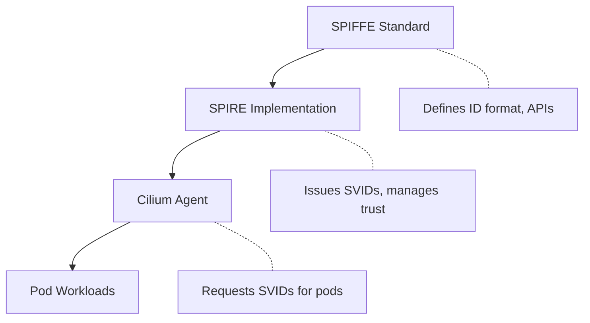

# SPIFFE - Secure Production Identity Framework for Everyone

## What is SPIFFE?

SPIFFE is a set of open-source standards for securely identifying workloads
in dynamic and heterogeneous environments. It provides a specification for:

- **SPIFFE ID**: A URI that uniquely identifies a workload
- **SVID**: SPIFFE Verifiable Identity Document (X.509 cert or JWT)
- **Workload API**: How workloads request their identity
- **Trust Bundle**: How trust is established between domains

## SPIFFE ID Format

```text
spiffe://trust-domain/path
```

Examples:

```text
spiffe://prod.metal3.local/ns/default/sa/frontend
spiffe://prod.metal3.local/cilium-agent
spiffe://workload-001.metal3.local/ns/app/sa/backend
```

Components:

- `spiffe://` - scheme (always this)
- `trust-domain` - root of trust (like a CA domain)
- `/path` - workload identifier (flexible, often namespace/service account)

## SVID - SPIFFE Verifiable Identity Document

Two formats:

| Format | Use Case |
| ------ | -------- |
| X.509-SVID | mTLS, certificate-based auth |
| JWT-SVID | Token-based auth, API calls |

For Cilium mTLS, X.509-SVIDs are used.

## How SPIFFE Relates to Other Components



## Key Concepts

### Trust Domain

A trust domain is the root of identity. All workloads in a trust domain
can verify each other's identity. Separate trust domains require federation.

### Workload API

Standard API (Unix socket) for workloads to:

- Request their SVID
- Get trust bundles
- Receive rotation notifications

### Federation

Connecting separate trust domains so workloads can authenticate across
organizational boundaries.

## SPIFFE vs Traditional PKI

| Aspect | Traditional PKI | SPIFFE |
| ------ | --------------- | ------ |
| Identity | Hostname/IP based | Workload attributes |
| Issuance | Manual or slow automation | Automatic, attestation-based |
| Lifetime | Long (months/years) | Short (hours), auto-rotated |
| Scope | Static infrastructure | Dynamic, ephemeral workloads |

## References

- SPIFFE specification: [spiffe.io overview][spec]
- SPIFFE concepts: [spiffe.io concepts][concepts]

[spec]: https://spiffe.io/docs/latest/spiffe-about/overview/
[concepts]: https://spiffe.io/docs/latest/spiffe-about/spiffe-concepts/
