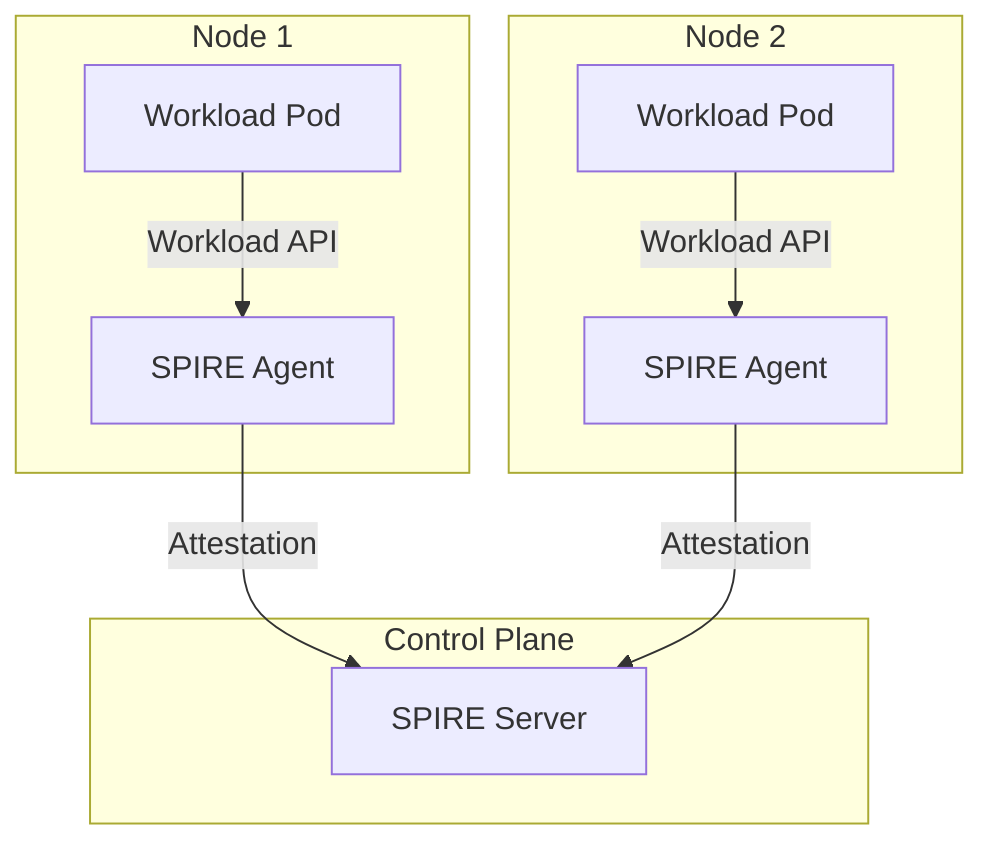
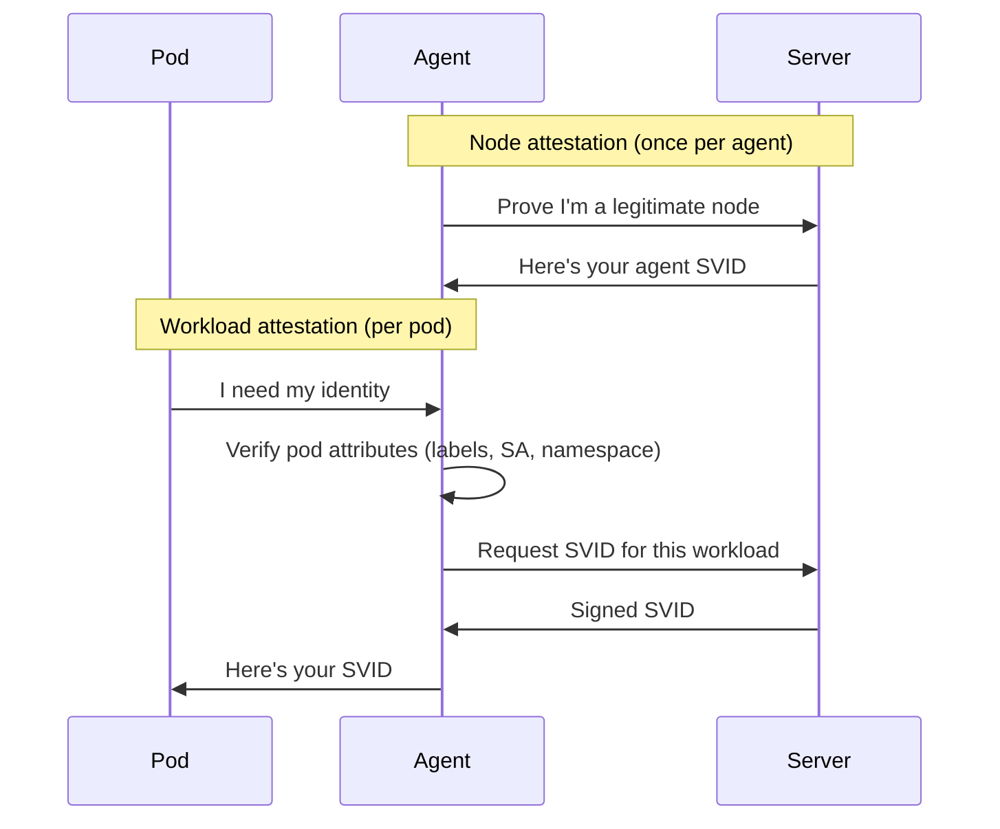

# SPIRE - SPIFFE Runtime Environment

## What is SPIRE?

SPIRE is the reference implementation of the SPIFFE specification. It's the
software that actually issues and manages workload identities.

**SPIFFE** = the standard (what)
**SPIRE** = the implementation (how)

## Architecture



## Components

### SPIRE Server

- Central authority for the trust domain
- Issues SVIDs to agents
- Manages registration entries (who gets what identity)
- Stores CA keys

### SPIRE Agent

- Runs on each node (DaemonSet in Kubernetes)
- Attests to server on startup (proves it's a legitimate node)
- Exposes Workload API to local pods
- Caches and rotates SVIDs

### Registration Entries

Define which workloads get which SPIFFE IDs:

```yaml
# Example: All pods in namespace "app" with SA "backend"
# get SPIFFE ID: spiffe://trust-domain/ns/app/sa/backend
spiffeID: spiffe://prod.metal3.local/ns/app/sa/backend
selectors:
  - k8s:ns:app
  - k8s:sa:backend
```

## Attestation Flow



## SPIRE in Kubernetes

Two deployment options:

### Option 1: External SPIRE (spire-controller-manager)

- You deploy SPIRE separately
- Use CRDs: ClusterSPIFFEID, ClusterStaticEntry
- Full control, federation-capable

### Option 2: Cilium Built-in SPIRE

- Cilium deploys SPIRE via Helm
- `authentication.mutual.spire.install.enabled=true`
- Simpler, but tied to Cilium lifecycle

## Key APIs

### Workload API

Unix socket for pods to get their identity:

```text
/run/spire/sockets/agent.sock
```

### Delegated Identity API

Admin socket for privileged workloads (like Cilium) to request
identities on behalf of other pods:

```text
/run/spire/sockets/admin.sock
```

Requires `authorized_delegates` configuration in SPIRE agent.

## SPIRE vs Other Identity Solutions

| Solution | Scope | Integration |
| -------- | ----- | ----------- |
| SPIRE | Workload identity | SPIFFE standard, broad ecosystem |
| Istio Citadel | Service mesh only | Istio-specific |
| Vault | Secrets + identity | General purpose, more complex |
| cert-manager | Certificate management | K8s native, not workload-aware |

## References

- SPIRE documentation: [spiffe.io SPIRE][docs]
- SPIRE on Kubernetes: [spiffe.io deploying][k8s]
- Helm charts: [GitHub helm-charts-hardened][helm]

[docs]: https://spiffe.io/docs/latest/spire-about/
[k8s]: https://spiffe.io/docs/latest/deploying/spire_agent/
[helm]: https://github.com/spiffe/helm-charts-hardened
