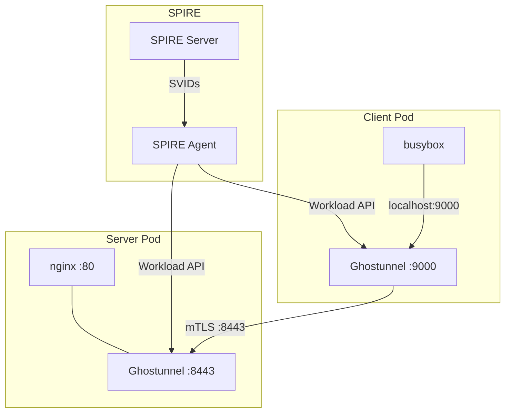

# Ghostunnel mTLS POC

Mutual TLS authentication using standalone SPIRE with Ghostunnel sidecars.
Supports both explicit proxy mode and transparent mode with init container.

## Performance

| Mode | TCP Throughput | HTTP p99 @ 1000 RPS | Max QPS |
| ------ | ---------------- | --------------------- | --------- |
| Explicit (app uses proxy port) | 1.49 Gbps | 5.6 ms | 49k |
| Transparent (iptables init) | 465 Mbps | 3.8 ms | 22k |

Comparison with other POCs:

| Solution | TCP | HTTP p99 | Max QPS | Transparent | CNI-agnostic |
| ---------- | ----- | ---------- | --------- | ------------- | -------------- |
| Cilium + SPIRE | 1.53 Gbps | 1.9 ms | 97k | Yes | No |
| Istio Ambient | 938 Mbps | 5.97 ms | 55k | Yes | Yes |
| Ghostunnel (explicit) | 1.49 Gbps | 5.6 ms | 49k | No | Yes |
| Ghostunnel (transparent) | 465 Mbps | 3.8 ms | 22k | Yes | Yes |

## Architecture



- SPIRE Server issues SPIFFE identities
- SPIRE Agent provides Workload API on each node
- Ghostunnel sidecars get certificates via `--spiffe-socket`
- Server mode: terminates mTLS, forwards to app
- Client mode: originates mTLS, listens on localhost

## Quick Start

```bash
# With Cilium (default)
make run

# With Calico
make run CNI=calico

# Clean up
make clean
```

## What Gets Deployed

1. Kind cluster (1 control-plane + 2 workers)
1. CNI with WireGuard encryption (Cilium or Calico)
1. Standalone SPIRE (server + agents)
1. Test workloads with Ghostunnel sidecars

## Make Targets

| Target | Description |
| ------ | ----------- |
| `make run` | Full e2e with Cilium |
| `make run CNI=calico` | Full e2e with Calico |
| `make clean` | Delete cluster |
| `make validate` | Check deployment health |
| `make perf` | Run explicit mode perf test |

## How It Works

1. Client app connects to `localhost:9000` (plaintext)
1. Ghostunnel client wraps connection in mTLS
1. Connection goes to server's Ghostunnel on port 8443
1. Server Ghostunnel verifies client SPIFFE ID
1. If authorized, forwards to nginx on localhost:80

## Implementation

### Overview

Ghostunnel is a simple TLS proxy purpose-built for mTLS. Unlike Envoy,
it has no L7 features but adds minimal overhead.

| Aspect | Ghostunnel | Envoy |
| ------ | ---------- | ----- |
| Binary size | ~15 MB | ~60 MB |
| Memory | Low | Higher |
| L7 features | No | Yes |
| Configuration | CLI flags | YAML/xDS |

### Prerequisites

- Phase 1 complete (SPIRE server and agents running) - see [FOUNDATION.md](../docs/FOUNDATION.md)
- CNI encryption configured (see [CNI-ENCRYPTION.md](../docs/CNI-ENCRYPTION.md))

### Step 1: Create ClusterSPIFFEID for Workloads

```bash
kubectl apply -f - <<YAML
apiVersion: spire.spiffe.io/v1alpha1
kind: ClusterSPIFFEID
metadata:
  name: default-workloads
spec:
  spiffeIDTemplate: >-
    spiffe://prod.metal3.local/ns/{{ .PodMeta.Namespace }}/sa/{{
    .PodSpec.ServiceAccountName }}
  podSelector:
    matchLabels:
      spiffe-enabled: "true"
  namespaceSelector:
    matchExpressions:
    - key: kubernetes.io/metadata.name
      operator: NotIn
      values:
      - kube-system
      - spire-system
  ttl: 1h
YAML
```

### Step 2: Deploy Backend with Ghostunnel Sidecar (Server Mode)

```bash
kubectl apply -f - <<YAML
apiVersion: v1
kind: ServiceAccount
metadata:
  name: backend
  namespace: default
---
apiVersion: apps/v1
kind: Deployment
metadata:
  name: backend
  namespace: default
spec:
  replicas: 1
  selector:
    matchLabels:
      app: backend
  template:
    metadata:
      labels:
        app: backend
        spiffe-enabled: "true"
    spec:
      serviceAccountName: backend
      containers:
      - name: app
        image: nginx:alpine
        ports:
        - containerPort: 8080
      - name: ghostunnel
        image: ghostunnel/ghostunnel:v1.9.1
        args:
        - server
        - --listen=:8443
        - --target=localhost:8080
        - --use-workload-api-addr=unix:///run/spire/socket/agent.sock
        - --allow-uri-san=spiffe://prod.metal3.local/ns/default/sa/client
        ports:
        - containerPort: 8443
        volumeMounts:
        - name: spire-socket
          mountPath: /run/spire/socket
          readOnly: true
      volumes:
      - name: spire-socket
        hostPath:
          path: /run/spire/socket
          type: Directory
---
apiVersion: v1
kind: Service
metadata:
  name: backend
  namespace: default
spec:
  selector:
    app: backend
  ports:
  - port: 8443
    targetPort: 8443
YAML
```

### Step 3: Deploy Client with Ghostunnel Sidecar (Client Mode)

```bash
kubectl apply -f - <<YAML
apiVersion: v1
kind: ServiceAccount
metadata:
  name: client
  namespace: default
---
apiVersion: apps/v1
kind: Deployment
metadata:
  name: client
  namespace: default
spec:
  replicas: 1
  selector:
    matchLabels:
      app: client
  template:
    metadata:
      labels:
        app: client
        spiffe-enabled: "true"
    spec:
      serviceAccountName: client
      containers:
      - name: app
        image: curlimages/curl:latest
        command: ["sleep", "infinity"]
      - name: ghostunnel
        image: ghostunnel/ghostunnel:v1.9.1
        args:
        - client
        - --listen=localhost:9000
        - --target=backend.default.svc.cluster.local:8443
        - --use-workload-api-addr=unix:///run/spire/socket/agent.sock
        - --verify-uri-san=spiffe://prod.metal3.local/ns/default/sa/backend
        volumeMounts:
        - name: spire-socket
          mountPath: /run/spire/socket
          readOnly: true
      volumes:
      - name: spire-socket
        hostPath:
          path: /run/spire/socket
          type: Directory
YAML
```

### Step 4: Verify mTLS

```bash
# Check SPIRE entries
kubectl -n spire-system exec -it \
  $(kubectl -n spire-system get pod -l app.kubernetes.io/name=spire-server \
    -o jsonpath='{.items[0].metadata.name}') \
  -- /opt/spire/bin/spire-server entry show

# Test connection from client (via ghostunnel)
kubectl exec -it deploy/client -c app -- curl http://localhost:9000/

# Check ghostunnel logs
kubectl logs deploy/backend -c ghostunnel
kubectl logs deploy/client -c ghostunnel
```

## Access Control

Ghostunnel server uses `--allow-uri-san` to restrict which SPIFFE IDs can connect:

```bash
# Only allow specific workload
--allow-uri-san=spiffe://prod.metal3.local/ns/mtls-test/sa/client

# Allow any workload in namespace
--allow-uri-san=spiffe://prod.metal3.local/ns/mtls-test/
```

Additional authorization flags:

```bash
# Allow by CN
--allow-cn=client-name

# Allow by OU
--allow-ou=engineering
```

Reference: [Ghostunnel access flags](https://github.com/ghostunnel/ghostunnel/blob/master/docs/ACCESS-FLAGS.md)

## Comparison with Other POCs

| Aspect | Cilium | Istio Ambient | Ghostunnel |
| ------ | ------ | ------------- | ---------- |
| Proxy type | CNI agent | Per-node (ztunnel) | Sidecar |
| Traffic interception | Transparent | Transparent | Explicit |
| SPIRE integration | Built-in | N/A (istiod) | Native |
| Overhead | Lowest | Low | Per-pod |

## Limitations

### Transparent Mode Trade-offs

Transparent mode (with init container iptables) has lower throughput than
explicit mode because:

- iptables REDIRECT adds overhead per packet
- Traffic goes through two proxy hops (client sidecar + server sidecar)

Use explicit mode when performance is critical and app changes are acceptable.
Use transparent mode when you need zero app changes.

### Transparent mTLS Options Summary

| Approach | Transparent? | How |
| -------- | ------------ | --- |
| Cilium + SPIRE | Yes | eBPF on node |
| Istio Ambient | Yes | iptables on node (istio-cni) |
| Istio Sidecar | Yes | iptables in pod (istio-init) |
| Ghostunnel + init | Yes | iptables in pod (init container) |
| Ghostunnel (explicit) | No | App must use proxy port |

## Transparent Mode Targets

| Target | Description |
| ------ | ----------- |
| `make perf-transparent` | Run transparent mode perf test |
| `make perf` | Run explicit mode perf test |
| `make perf-transparent` | Run transparent mode perf test |
| `make clean` | Delete cluster |
| `make validate` | Check deployment health |

## Transparent Mode

To run with transparent interception (no app changes):

```bash
./scripts/perf-transparent.sh
```

This deploys pods with init containers that inject iptables rules:

```yaml
initContainers:
- name: ghostunnel-init
  image: alpine:latest
  securityContext:
    capabilities:
      add: [NET_ADMIN]
  command: [sh, -c]
  args:
  - |
    apk add --no-cache iptables
    # Redirect outbound traffic to server:5201 through ghostunnel
    iptables -t nat -A OUTPUT -p tcp -d $SERVER_IP --dport 5201 \
      -m owner ! --uid-owner 0 -j REDIRECT --to-port 15201
```

The `! --uid-owner 0` excludes ghostunnel's own traffic (runs as root) to
avoid redirect loops.

## Validation Checklist

- [ ] SPIRE entries created for backend and client service accounts
- [ ] Ghostunnel sidecars running and connected to SPIRE agent
- [ ] Client can reach backend via mTLS tunnel
- [ ] Ghostunnel logs show successful TLS handshakes

## Rollback

```bash
kubectl delete deployment backend client
kubectl delete service backend
kubectl delete serviceaccount backend client
kubectl delete clusterspiffeid default-workloads
```

## References

- [Ghostunnel](https://github.com/ghostunnel/ghostunnel)
- [Ghostunnel SPIFFE Workload API](https://github.com/ghostunnel/ghostunnel/blob/master/docs/SPIFFE-WORKLOAD-API.md)
- [Ghostunnel Access Flags](https://github.com/ghostunnel/ghostunnel/blob/master/docs/ACCESS-FLAGS.md)
