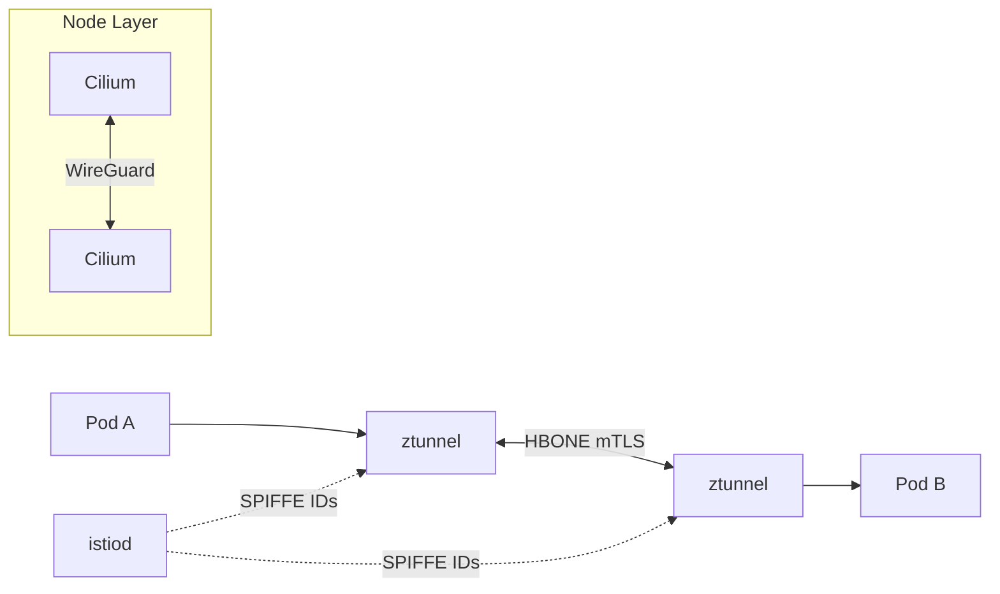

# Istio Ambient mTLS POC

Mutual TLS authentication using Istio Ambient mode with ztunnel proxies,
running on Cilium CNI with WireGuard for defense in depth.

## Architecture



- **istiod**: Control plane, issues SPIFFE identities
- **ztunnel**: Per-node L4 proxy, handles mTLS via HBONE protocol
- **istio-cni**: Traffic interception (chains with Cilium)
- **Cilium**: CNI + WireGuard (defense in depth)
- **PeerAuthentication**: STRICT mode blocks non-mesh traffic

## Quick Start

```bash
make run      # Full e2e: cluster, deploy, test, validate
make clean    # Delete cluster
```

## What Gets Deployed

1. Kind cluster (1 control-plane + 2 workers)
1. Cilium with Istio compatibility settings
1. Istio Ambient 1.27.0 (istiod, istio-cni, ztunnel)
1. Test namespace with ambient mode + STRICT mTLS

## Make Targets

| Target | Description |
| ------ | ----------- |
| `make run` | Full e2e test |
| `make clean` | Delete cluster |
| `make validate` | Run validation checks |
| `make e2e-test` | Run e2e test only |
| `make deploy-istio` | Deploy Istio only |

## Implementation

### Prerequisites

- Phase 1 complete (Cilium with WireGuard) - see [FOUNDATION.md](../docs/FOUNDATION.md)
- Cilium configured for Istio compatibility
- Istio 1.24+ recommended

**Status:** Istio Ambient is Stable (GA) since Istio 1.24. Multi-cluster
support is Alpha since 1.27.

### Step 1: Configure Cilium for Istio Compatibility

Cilium must allow Istio CNI to chain and not interfere with Istio's proxying:

```bash
helm upgrade cilium cilium/cilium \
  --namespace kube-system \
  --reuse-values \
  --set socketLB.hostNamespaceOnly=true \
  --set cni.exclusive=false
```

Verify:

```bash
kubectl get configmaps -n kube-system cilium-config -oyaml | grep -E "bpf-lb-sock-hostns|cni-exclusive"
# Should show:
# bpf-lb-sock-hostns-only: "true"
# cni-exclusive: "false"
```

### Step 2: Install Istio Base

```bash
helm repo add istio https://istio-release.storage.googleapis.com/charts
helm repo update

helm install istio-base istio/base \
  -n istio-system \
  --create-namespace \
  --wait
```

Verify CRDs:

```bash
kubectl get crds | grep istio.io
```

### Step 3: Install Gateway API CRDs

Required for waypoint proxy configuration:

```bash
kubectl apply --server-side -f \
  https://github.com/kubernetes-sigs/gateway-api/releases/download/v1.4.0/standard-install.yaml
```

### Step 4: Install istiod with Ambient Profile

```bash
helm install istiod istio/istiod \
  -n istio-system \
  --set profile=ambient \
  --wait
```

Verify:

```bash
kubectl -n istio-system get pods -l app=istiod
```

### Step 5: Install Istio CNI

```bash
helm install istio-cni istio/cni \
  -n istio-system \
  --set profile=ambient \
  --wait
```

Verify:

```bash
kubectl -n istio-system get daemonset istio-cni-node
```

### Step 6: Install ztunnel

```bash
helm install ztunnel istio/ztunnel \
  -n istio-system \
  --wait
```

Verify:

```bash
kubectl -n istio-system get daemonset ztunnel
istioctl proxy-status
```

### Step 7: Enable Ambient Mode for Namespace

Label namespace to enroll workloads in ambient mesh:

```bash
kubectl create namespace mtls-test
kubectl label namespace mtls-test istio.io/dataplane-mode=ambient
```

### Step 8: Deploy Test Workloads

```bash
kubectl -n mtls-test run server --image=nginx --port=80
kubectl -n mtls-test expose pod server --port=80
kubectl -n mtls-test run client --image=curlimages/curl --command -- sleep 3600
```

Wait for pods and test:

```bash
sleep 10
kubectl -n mtls-test exec client -- curl -s http://server
```

### Step 9: Verify mTLS

Check ztunnel logs for encrypted traffic:

```bash
kubectl logs -n istio-system daemonset/ztunnel -f | grep "mtls-test"
```

Look for entries showing `src.identity` and `dst.identity` with SPIFFE IDs.

Verify workloads are enrolled:

```bash
istioctl ztunnel-config workload | grep mtls-test
# Should show HBONE protocol
```

### Step 10: (Optional) Add Waypoint Proxy for L7

Only needed if you require L7 features (HTTP routing, retries, etc.):

```bash
kubectl apply -f - <<EOF
apiVersion: gateway.networking.k8s.io/v1
kind: Gateway
metadata:
  name: mtls-test-waypoint
  namespace: mtls-test
  labels:
    istio.io/waypoint-for: all
spec:
  gatewayClassName: istio-waypoint
  listeners:
  - name: mesh
    port: 15008
    protocol: HBONE
    allowedRoutes:
      namespaces:
        from: Same
EOF

kubectl label namespace mtls-test istio.io/use-waypoint=mtls-test-waypoint
```

## Key Configuration

Cilium Istio compatibility (`manifests/cilium-values.yaml`):

```yaml
cni:
  exclusive: false
socketLB:
  hostNamespaceOnly: true
```

STRICT mTLS (applied in e2e-test.sh):

```yaml
apiVersion: security.istio.io/v1
kind: PeerAuthentication
metadata:
  name: strict-mtls
spec:
  mtls:
    mode: STRICT
```

## Advantages Over Cilium + SPIRE

- Lower latency (~8% vs ~99%)
- Same-node mTLS (ztunnel handles all traffic)
- L7 features available via waypoint proxy
- More mature mTLS implementation

## Limitations

### Cilium L7 Policy Conflict

Cannot use both Cilium L7 policies AND Istio mTLS simultaneously.
Choose one:

- Istio for L7 policy (with mTLS) - recommended with this setup
- Cilium for L7 policy (disable Istio mTLS for those workloads)

### Two Control Planes

Running both Cilium and Istio means:

- Two systems to monitor and upgrade
- Potential for configuration conflicts
- Higher resource overhead

### WireGuard Redundancy

With Istio Ambient handling mTLS, Cilium WireGuard provides additional
node-to-node encryption. This is defense-in-depth but adds overhead.
Consider disabling WireGuard if Istio mTLS is sufficient.

## Comparison: Cilium mTLS vs Istio Ambient

| Aspect | Cilium + SPIRE | Istio Ambient |
| ------ | -------------- | ------------- |
| Latency overhead | +99% | +8% |
| L7 features | No | Yes (with waypoint) |
| Control planes | 1 (SPIRE) | 2 (SPIRE + istiod) |
| Complexity | Lower | Higher |
| Same-node mTLS | No | Yes |

## E2E Test

The test proves mTLS enforcement:

1. **Positive**: Cross-node traffic via ztunnel succeeds
1. **Negative**: Plaintext traffic from non-mesh pod is blocked

## Rollback

Remove Istio components:

```bash
helm uninstall ztunnel -n istio-system
helm uninstall istio-cni -n istio-system
helm uninstall istiod -n istio-system
helm uninstall istio-base -n istio-system
kubectl delete namespace istio-system
```

Restore Cilium defaults:

```bash
helm upgrade cilium cilium/cilium \
  --namespace kube-system \
  --reuse-values \
  --set socketLB.hostNamespaceOnly=false \
  --set cni.exclusive=true
```

## References

- Istio Ambient docs: <https://istio.io/latest/docs/ambient/>
- Cilium + Istio integration: <https://docs.cilium.io/en/latest/network/servicemesh/istio/>
- Istio Ambient install guide: <https://devopscube.com/setup-istio-ambient-mode/>
